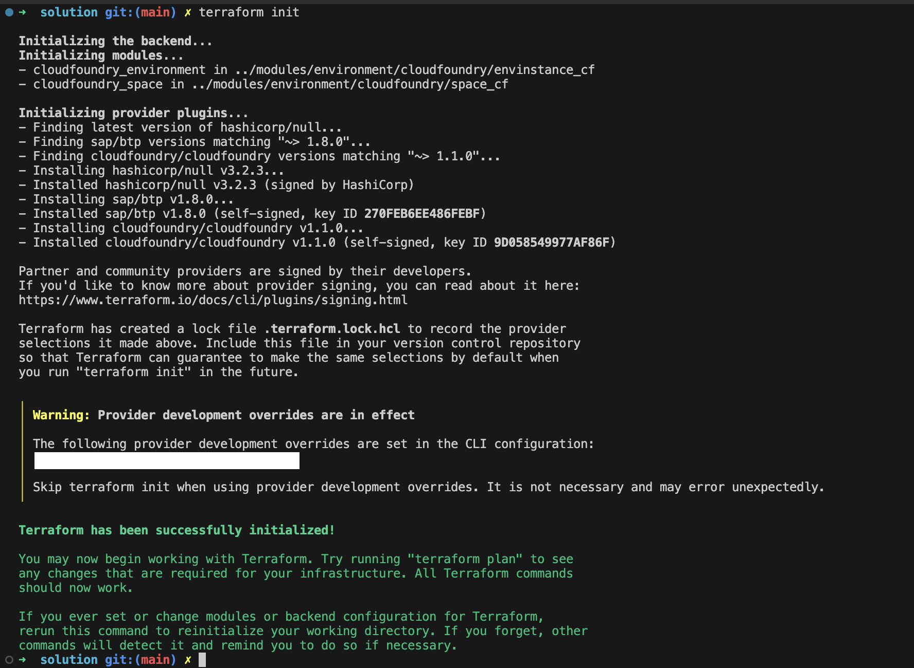
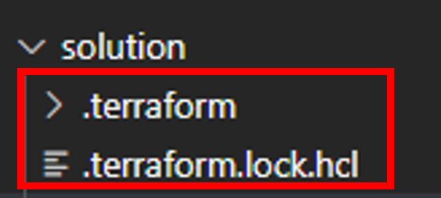
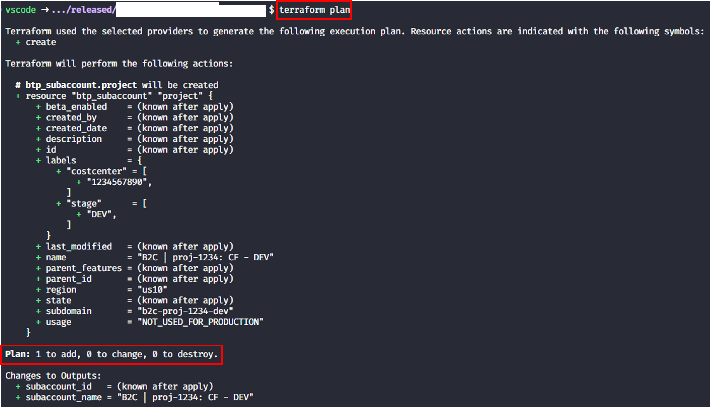
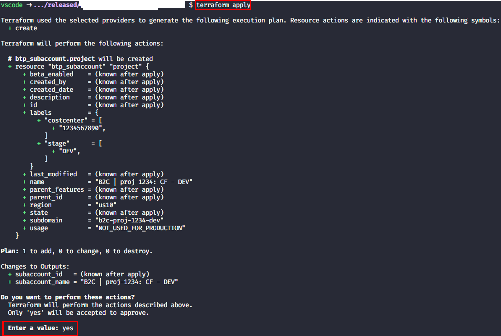
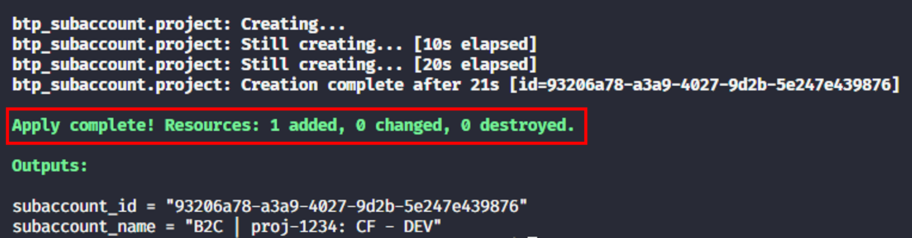
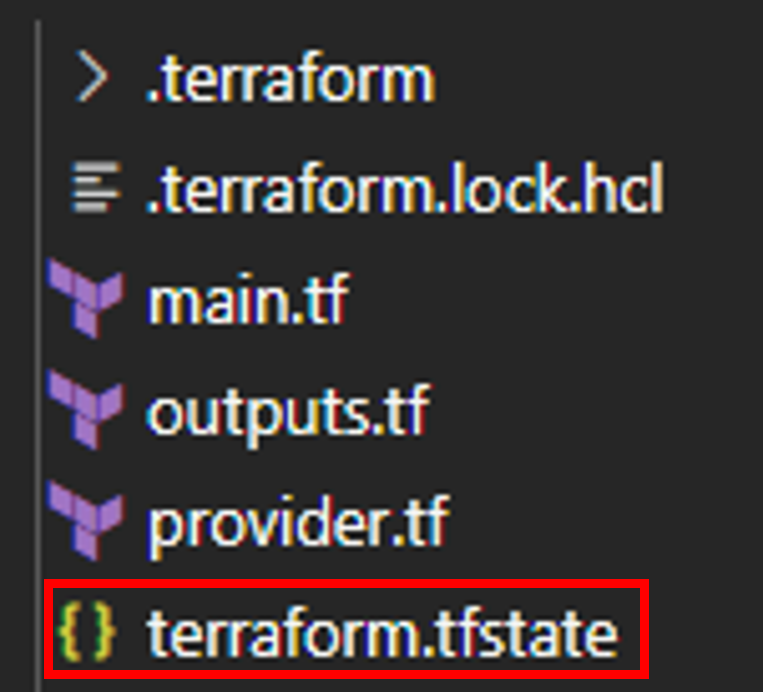
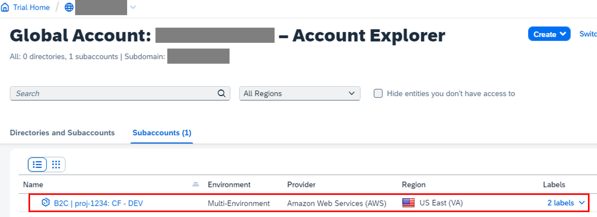

# Exercise 2 - Setup of a subaccount

## Goal of this Exercise 🎯

The goal of this exercise is to setup a *subaccount* in the SAP BTP using the Terraform provider. Besides that we will learn how to work with `variables` and `outputs` in Terraform. As a cherry on top we will also learn how to validate user input.

## Create the subaccount configuration

### Step 1: Input variables

We want to create a subaccount that follows a specific naming convention and has additional information about the development project like the cost center displayed via labels. To achieve this we will use input variables in Terraform.

We want to have the following input when creating a subaccount as base information:

- *region* - The region where the subaccount should be created. We will default this to `us10` for the purpose of this exercise.
- *project name* - The name of the project. We want to validate the input to follow a specific naming convention.
- *stage* - The stage of the project. We want to validate the input to be either `DEV`, `TST` or `PRD`.
- *cost center* - The cost center of the project. We want to validate the input to be a valid number.
- *organization name* - The organization where the subaccount should be created. We want to validate this against several fixed values.

#### Input variable *region*

Open the file `variables.tf` and add the following code to define the input variable for *region*:

```terraform
variable "region" {
  type        = string
  description = "The region where the project account shall be created in."
  default     = "us10"
}
```

As you can see a variable has a name (`region`) so that we can address it from the Terraform configuration. It also has a type (`string`) and a description. The `default` value is optional and will be used if no value is provided when running Terraform.

#### Input variable *project_name*

Add the following code to define the *project name* the `variables.tf` file:

```terraform
variable "project_name" {
  type        = string
  description = "The subaccount name."
  default     = "proj-1234"

  validation {
    condition     = can(regex("^[a-zA-Z0-9_\\-]{1,200}", var.project_name))
    error_message = "Provide a valid project name."
  }
}
```

This variable contains an additional `validation` block. This block contains a `condition` that checks if the input matches the regular expression. If the condition is not met, the `error_message` will be displayed. We use the [`can` expression](https://developer.hashicorp.com/terraform/language/functions/can) to check if the input is valid when compared to a specific regular expression leveraging the [`regex` function](https://developer.hashicorp.com/terraform/language/functions/regex).

As we will later construct the subdomain based on the project name, change the default value `proj-1234` to something unique by using your name, birthday or something similar.

#### Input variable *stage*

Let us continue with the *stage* variable that should be validated against some fixed values. To do so add the following code to the `variables.tf` file:

```terraform
variable "stage" {
  type        = string
  description = "The stage/tier the account will be used for."
  default     = "DEV"

  validation {
    condition     = contains(["DEV", "TST", "PRD"], var.stage)
    error_message = "Select a valid stage for the project account."
  }
}
```

You can see a different type of validation here. We use the [`contains` function](https://developer.hashicorp.com/terraform/language/functions/contains) to check if the input is part of the list of valid stages.


#### Input variable *costcenter*

Let us move on to the *cost center* variable. Add the following code to the `variables.tf` file:

```terraform
variable "costcenter" {
  type        = string
  description = "The cost center the account will be billed to."
  default     = "1234567890"

  validation {
    condition     = can(regex("^[0-9]{10}", var.costcenter))
    error_message = "Provide a valid cost center."
  }
}
```

Nothing new here that we have not seen before. We use the `can` expression to check if the input is valid when compared to a specific regular expression leveraging the `regex` function.

> [!NOTE]
> You can also use functions inside of functions to express more complex conditions such as [concat function](https://developer.hashicorp.com/terraform/language/functions/concat) to combine multiple lists into one list and then use the `contains` function to check if the input is part of that list.

#### Input variable *org_name*

And last but not least we want to add and validate the *organization name* variable. Add the following code to the `variables.tf` file:

```terraform
variable "org_name" {
  type        = string
  description = "Defines to which organization the project account shall belong to."
  default     = "B2C"
}
```

As we have all variables in place, you should save the changes now.

> [!NOTE]
> As you can see you have a lot of possibilities to validate the user input in Terraform in this way ensure that the input is correct and meets your corporate requirements.

We have defined the  `project_name` which is required for the subaccount creation. We will provide the value for this variable via the `terraform.tfvars` file. Open
the file `terraform.tfvars` and append the following content to the end of the file:

```terraform
project_name  = "<YOUR LAST NAME>"
```

### Step 2: Local values

Now we want to leverage the input variables to create a subaccount name that follows a specific naming convention. Here are the conditions:

- The subaccount name shall follow the pattern `<org_name> | <project_name>: CF - <stage>`.
- The subaccount domain shall follow the pattern `<org_name>-<project_name>-<stage>`. We must ensure that there are no spaces in the domain name and all letters are lowercase.

To achieve this we use [local values](https://developer.hashicorp.com/terraform/language/values/locals) to construct the names. Open the file `main.tf` and add the following code to define the local values:

```terraform
locals {
  project_subaccount_name = "${var.org_name} | ${var.project_name}: CF - ${var.stage}"
  project_subaccount_domain = lower(replace("${var.org_name}-${var.project_name}-${var.stage}", " ", ""))
}
```

For the subaccount name we referenced the values of the variables and combined them to a string using the `${}` syntax. For the subaccount domain we used the [`replace` function](https://developer.hashicorp.com/terraform/language/functions/replace) to remove spaces from the domain name and the [`lower` function](https://developer.hashicorp.com/terraform/language/functions/lower) to bring all letter in lowercase.

As we have all local values in place, you should save the changes now.

### Step 3: The subaccount configuration

As all bits and pieces are in place we can now create the subaccount configuration. Besides the name and domain we also want to add labels to the subaccount to display the stage and cost center. In addition we want to set the usage of the subaccount to `NOT_USED_FOR_PRODUCTION`.

Add the following code in the `main.tf` file to define the subaccount configuration:

```terraform
resource "btp_subaccount" "project" {
  name      = local.project_subaccount_name
  subdomain = local.project_subaccount_domain
  region    = lower(var.region)
  labels = {
    "stage"      = ["${var.stage}"],
    "costcenter" = ["${var.costcenter}"]
  }
}
```

We used the resource [`btp_subaccount`](https://registry.terraform.io/providers/SAP/btp/latest/docs/resources/subaccount) to create the subaccount. We referenced the local values to set the name and domain. We added labels to the subaccount to display the stage and cost center.

As we have the configuration in place, you should save the changes now.

### Step 4: Output values

Before we can finally apply the Terraform configuration we want to add an output value to display the subaccount name id. Add the following code to the `outputs.tf` file to define the output value:

```terraform
output "subaccount_id" {
  value       = btp_subaccount.project.id
  description = "The ID of the project subaccount."
}

output "subaccount_name" {
  value       = btp_subaccount.project.name
  description = "The name of the project subaccount."
}
```

These output values will display the ID and name of the created subaccount after the Terraform configuration has been successfully applied.

As we have all output values in place, you should save the changes now.

### Step 5: Apply the Terraform configuration

Now the moment has come to apply the Terraform configuration for the first time. Open a terminal window and execute the following commands:

1. Initialize the Terraform configuration to download the required provider:

    ```bash
    terraform init
    ```

    You should see an output similar to the following:

    

> [!NOTE]
> Check your files. You should have a new folder called `.terraform` as well as new file called `.terraform.lock.hcl` in your directory. This means that the Terraform provider has been successfully downloaded and the version constraints are stored for your setup.



2. Plan the Terraform configuration to see what will be created:

    ```bash
    terraform plan
    ```

    You should see an output similar to the following:

    

3. Apply the Terraform configuration to create the subaccount:

    ```bash
    terraform apply
    ```

    You will be prompted to confirm the creation of the subaccount. Type `yes` and press `Enter` to continue. You should see an output similar to the following:

    

    

After the application you will find a new file called `terraform.tfstate` in your directory. This file contains the [state](https://developer.hashicorp.com/terraform/language/state) of the Terraform configuration and is used to keep track of the resources that have been created:



> [!IMPORTANT]
> In real life you would not store this file locally but use a [remote backend](https://developer.hashicorp.com/terraform/language/backend) that is capable of storing the state in a secure and consistent way. For the purpose of this exercise we will use the local backend.

> [!NOTE]
> In case you are getting an error that the subdomain already exists, you need change the project name in the `variables.tf` file.

You can also check that everything is in place via the SAP BTP cockpit. You should see a new subaccount that comprises our configuration:



## Additional information

Here you find additional information on the used Terraform features and functions:

- Terraform documentation on [input variables](https://developer.hashicorp.com/terraform/language/values/variables)
- Terraform documentation on [validation](https://developer.hashicorp.com/terraform/language/validate#input-variable-validation)
- Terraform documentation on [output values](https://developer.hashicorp.com/terraform/language/values/outputs)
- Terraform documentation on [local values](https://developer.hashicorp.com/terraform/language/values/locals)

## Summary

You've now successfully created a subaccount.

Continue to - [Exercise 3 - Assign entitlements to a subaccount](../EXERCISE3/README.md).
