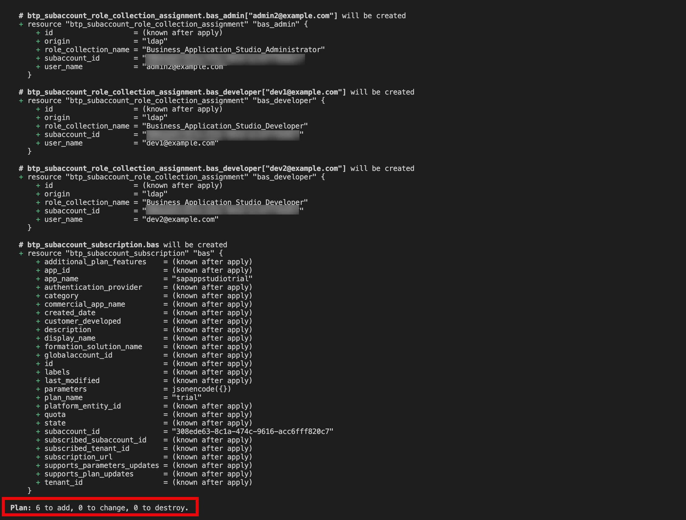
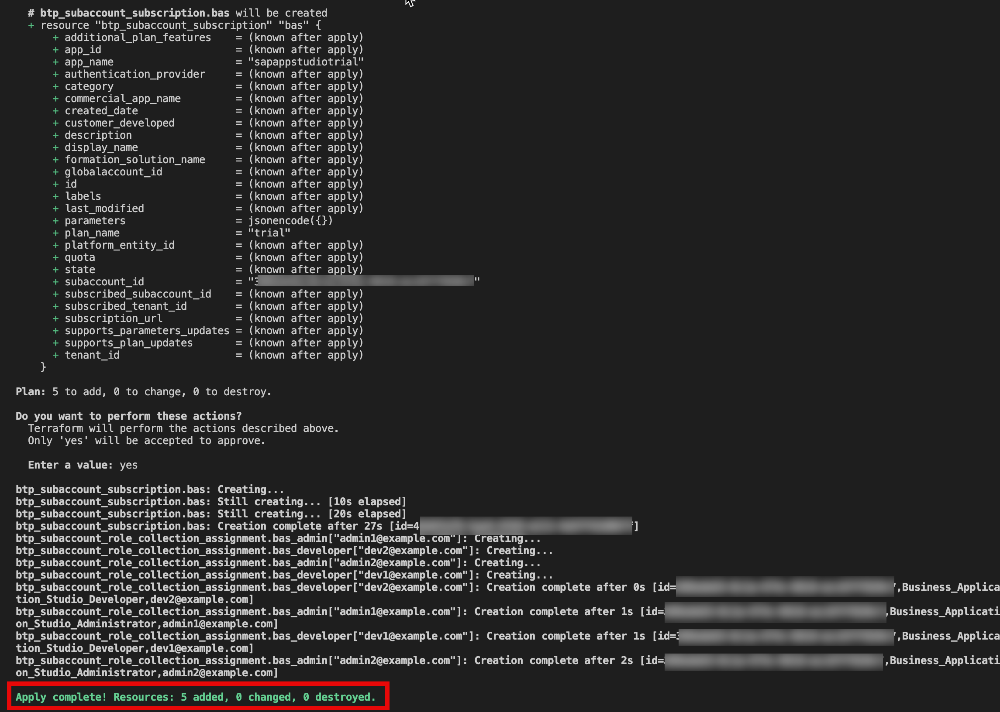

# Exercise 3 - Assign entitlement,Subscription and its role assignments to a subaccount

## Goal of this Exercise 🎯

In this exercise, you will learn how add an entitlement to a subaccount using Terraform.

## Entitle the subaccount with Business Application Stuido (BAS)

## Step 1: Configure BAS

Our goal is to configure Business Application Studio (BAS) for the subaccount by defining the necessary resources for entitlement, subscription, and role assignments.

We will define the variables in the `variable.tf` file. Open the `variable.tf` file and add the following code.


```terraform
variable "bas_admins" {
  type        = list(string)
  description = "List of users to assign the Administrator role."

}
variable "bas_developers" {
  type        = list(string)
  description = "List of users to assign the Developer role."
}
variable "bas_service_name" {
  type        =  string
  description = "Service name for Business Application Studio."
  default     = "sapappstudio"

}
variable "bas_plan" {
  type        = string
  description = "Plan name for Business Application Studio."
  default     = "standard"
}
```

We define a complex variable type, which is a [list](https://developer.hashicorp.com/terraform/language/expressions/types#lists-tuples) of [objects](https://developer.hashicorp.com/terraform/language/expressions/types#maps-objects). Each object has three attributes: `name`, `plan`, and `amount`. The `name` and `plan` attributes are strings, and the `amount` attribute is a number. We define a default value for the variable, which is an empty list.We will provide values for this parameter via the file `terraform.tfvars` in the next step. Save the changes.

## Step 2: Add the variable to the tfvars file

Now we need to specify the entitlements we want to create to the `terraform.tfvars` file.

We want to add the following entitlements to the subaccount:

- `sapappstudiotrial` application with the `trial` plan

Open the `terraform.tfvars` file and add the following code:

```terraform
bas_service_name = "sapappstudiotrial"
bas_plan = "trial"
bas_admins = ["admin1@example.com", "admin2@example.com"]
bas_developers = ["dev1@example.com", "dev2@example.com"]
```

## Step 3: Add the entitlements configuration

As we have the variable and the values for the `BAS` in place, we can now add the configuration to assign the entitlement to the subaccount. We use the resource [btp_subaccount_entitlement](https://registry.terraform.io/providers/SAP/btp/latest/docs/resources/subaccount_entitlement) to achieve this. Open the `main.tf` file and add the following code:

```terraform
resource "btp_subaccount_entitlement" "bas" {
  subaccount_id = btp_subaccount.project.id
  service_name  = var.bas_service_name
  plan_name     = var.bas_plan
}

resource "btp_subaccount_subscription" "bas" {
  subaccount_id = btp_subaccount.project.id
  app_name      = var.bas_service_name
  plan_name     = var.bas_plan
  depends_on    = [btp_subaccount_entitlement.bas]
}

resource "btp_subaccount_role_collection_assignment" "bas_admin" {
  for_each             = toset(var.bas_admins)
  subaccount_id        = btp_subaccount.project.id
  role_collection_name = "Business_Application_Studio_Administrator"
  user_name            = each.value
  depends_on           = [btp_subaccount_subscription.bas]
}

resource "btp_subaccount_role_collection_assignment" "bas_developer" {
  for_each             = toset(var.bas_developers)
  subaccount_id        = btp_subaccount.project.id
  role_collection_name = "Business_Application_Studio_Developer"
  user_name            = each.value
  depends_on           = [btp_subaccount_subscription.bas]
}
```

We iterate through the list of entitlement and create a resource for `BAS`. We use the[`for_each` meta-argument](https://developer.hashicorp.com/terraform/language/meta-arguments/for_each) to achieve this. The `for_each` argument works on a map, so we must transform our list of users into a map leveraging Terraform's automatic type conversion via the [`for` expression](https://developer.hashicorp.com/terraform/language/expressions/for#result-types) for setting up the map. As for the subaccount administrators we access the value of the current iteration via `each.value` and reference the corresponding attributes of the object. The `subaccount_id` is set to the id of the subaccount we created in the previous exercise. Save the changes.

## Step 4: Apply the changes

Now we can apply the changes to our subaccount. Run the following commands:

> [!NOTE]
> As we did not change the configuration of the provider or add any Terraform [modules](https://developer.hashicorp.com/terraform/language/modules), we do not need to run `terraform init` again.

1. Plan the Terraform configuration to see what will be created:

    ```bash
    terraform plan
    ```

    You should see the following output:

    

2. Apply the Terraform configuration to add the entitlements:

    ```bash
    terraform apply
    ```

    You will be prompted to confirm the creation of the entitlements. Type `yes` and press `Enter` to continue. You should see the following output:

    

You can also check that everything is in place via the SAP BTP cockpit. You should see the assigned entitlements in the subaccount.

## Summary

You've now successfully entitled services and applications to the subaccount.

Continue to - [Exercise 4 - Setup a Cloud Foundry environment](../EXERCISE4/README.md).
