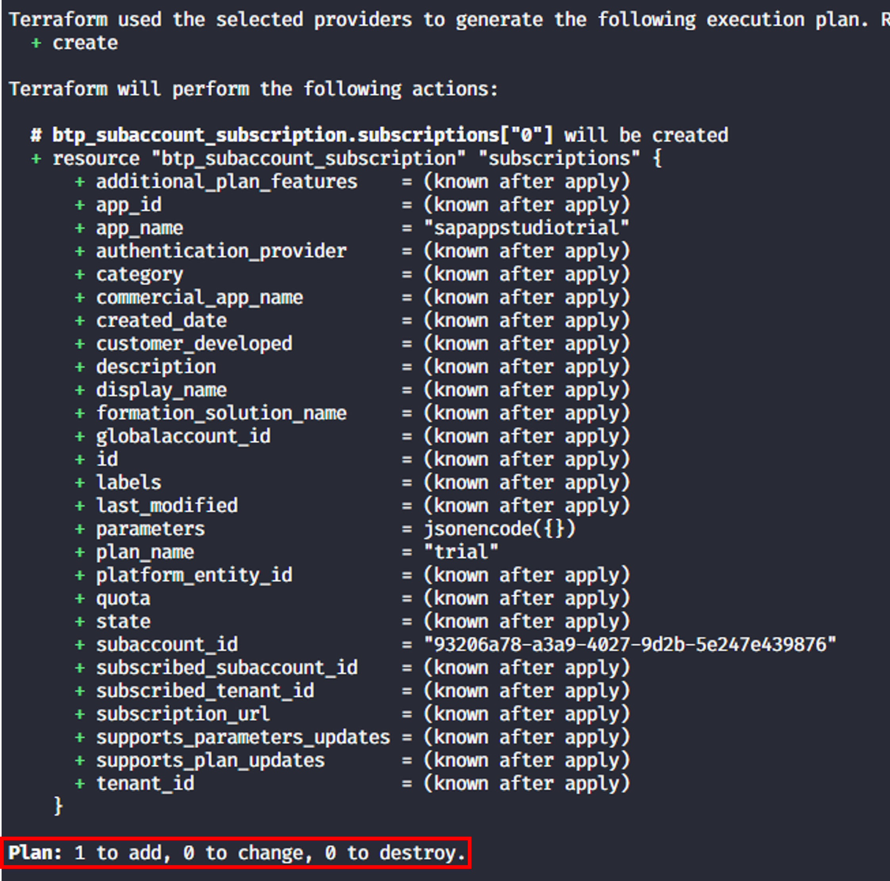
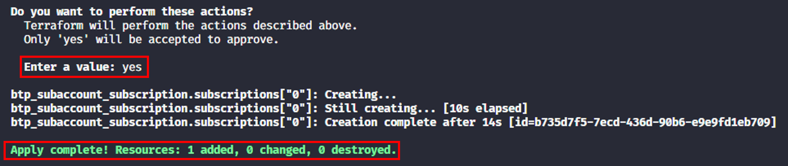
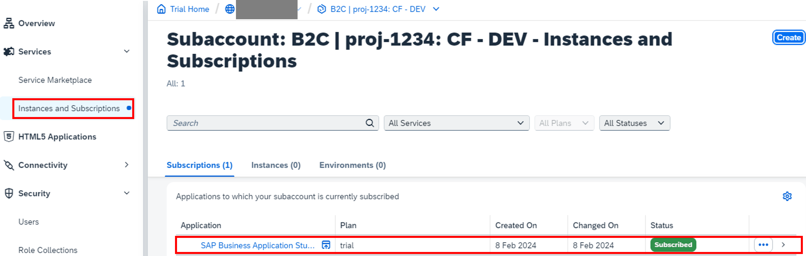
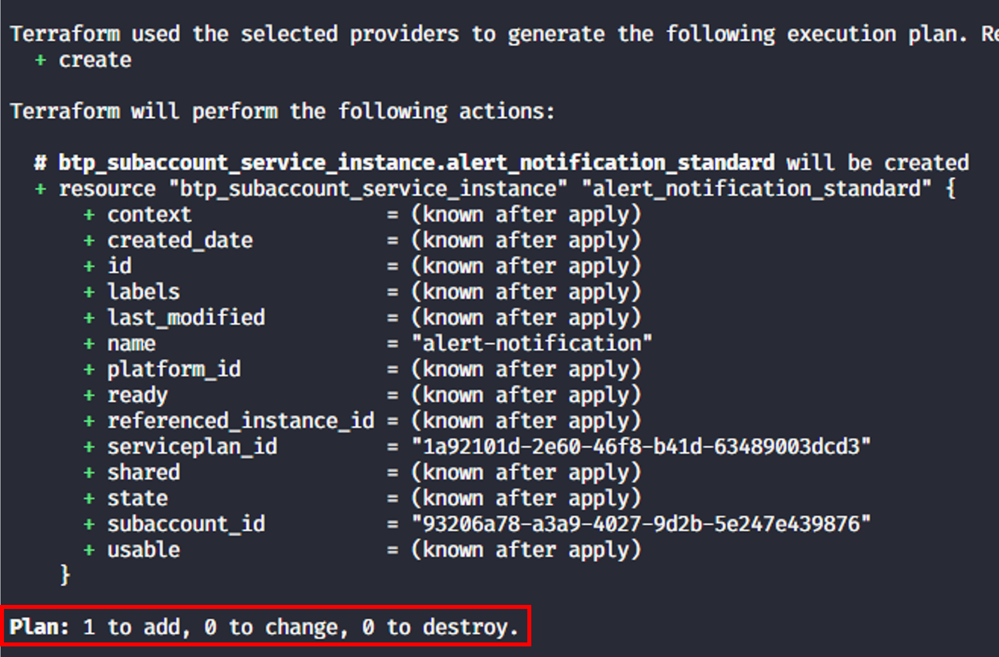
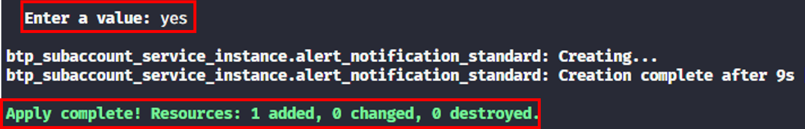
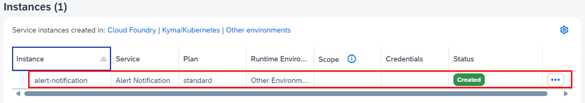

# Exercise 5 - Create service instances and app subscriptions

## Goal of this Exercise 🎯

In this exercise, you will create a service instance and an app subscription in the subaccount. You will learn a new building block of the SAP BTP Terraform provider, namely [data sources](https://developer.hashicorp.com/terraform/language/data-sources). Data sources allow you to fetch information from the SAP BTP environment and use it in your Terraform configuration.

## 1. Create an app subscription

### Step 1.1: Enhance the variables

Our goal is to have one variable that contains the list of app subscriptions that we want to subscribe to in the subaccount. An app subscription is an object that consists of several attributes, such as the application name and the plan name. We will define the variable `subscriptions` in the `variables.tf` file. Open the `variables.tf` file and add the following code:

```terraform
variable "subscriptions" {
  type = list(object({
    app_name = string
    plan     = string
  }))
  description = "List of app subscriptions to be subscribed to in the subaccount."
  default     = []
}
```

As for the entitlements, we define a complex variable type, which is a [list](https://developer.hashicorp.com/terraform/language/expressions/types#lists-tuples) of [objects](https://developer.hashicorp.com/terraform/language/expressions/types#maps-objects). Each object has two attributes: `app_name` and `plan`. Both attributes are strings. We define a default value for the variable, which is an empty list. We will provide values for this parameter via the file `terraform.tfvars` in the next step. Save the changes.

### Step 1.2: Add the variable to the tfvars file

We want to add an app subscription to the Business Application Studio to the subaccount. Open the `terraform.tfvars` file and add the following code:

```terraform
subscriptions = [
  {
    app_name = "sapappstudiotrial"
    plan     = "trial"
  }
]
```

The setup is the same as in the previous exercise, but this time we only add one entry into the list. Save the changes.

### Step 1.3: Add the subcription configuration

We will use the [`btp_subaccount_subscription`](https://registry.terraform.io/providers/SAP/btp/latest/docs/resources/subaccount_subscription) resource to create the app subscription. Open the `main.tf` file and add the following code:

```terraform
resource "btp_subaccount_subscription" "subscriptions" {
  for_each = {
    for index, subscription in var.subscriptions :
    index => subscription
  }

  subaccount_id = btp_subaccount.project.id
  app_name      = each.value.app_name
  plan_name     = each.value.plan
  depends_on    = [btp_subaccount_entitlement.entitlements]
}
```

We already know the `for_each` loop from the previous exercise. This time we use it to iterate over the `subscriptions` variable.

There is one further hing we need to ensure, namely that Terraform executes the app subscription *after* the availability of the entitlements. Terraform cannot deduct the dependency on its own as there is no connection between the resource used for the entitlements and the one for the subscriptions. We therefore use the [`depends_on`](https://developer.hashicorp.com/terraform/language/meta-arguments/depends_on) meta-argument to ensure that the entitlements are created before the app subscription is initiated. Save the changes.

### Step 1.4: Apply the changes

Now we can apply the changes to our subaccount. Run the following commands:

> [!NOTE]
> As we did not change the configuration of the provider or add any Terraform [modules](https://developer.hashicorp.com/terraform/language/modules), we do not need to run `terraform init` again.

1. Plan the Terraform configuration to see what will be created:

    ```bash
    terraform plan
    ```

    You should see the following output:

    

2. Apply the Terraform configuration to create the subaccount:

    ```bash
    terraform apply
    ```

    You will be prompted to confirm the creation of the subaccount. Type `yes` and press `Enter` to continue. You should see the following output:

    

You can also check that everything is in place via the SAP BTP cockpit. You should see the app subscription in the subaccount:



## 2. Create a service instance

In addition to the app subscription, we want to create a service instance of the `alert-notification`service with the plan `standard`. We will use the [btp_subaccount_service_instance](https://registry.terraform.io/providers/SAP/btp/latest/docs/resources/subaccount_service_instance) resource to achieve this. For the sake of the hands-on exercise, we will create the instance in a hard coded way. In a real-world scenario, you would use variables to define the service instance.

### Step 2.1: Add the service instance configuration

If you check the [documentation](https://registry.terraform.io/providers/SAP/btp/latest/docs/resources/subaccount_service_instance) of the `btp_subaccount_service_instance` resource, you will see that the resource requires the attribute [serviceplan_id](https://registry.terraform.io/providers/SAP/btp/latest/docs/resources/subaccount_service_instance#serviceplan_id). This technical ID is nothing we have at hand, so how can we get this information? This is where the [data sources](https://developer.hashicorp.com/terraform/language/data-sources) come into play. Data sources allow you to fetch information from the SAP BTP environment and use it in your Terraform configuration. We will use the [btp_subaccount_service_plan](https://registry.terraform.io/providers/SAP/btp/latest/docs/data-sources/subaccount_service_plan) data source to fetch the service plan ID via the service name and the plan name.

Open the `main.tf` file and add the following code:

```terraform
data "btp_subaccount_service_plan" "alert_notification_standard_plan" {
  subaccount_id = btp_subaccount.project.id
  name          = "standard"
  offering_name = "alert-notification"
  depends_on    = [btp_subaccount_entitlement.entitlements]
}
```

As you can see, we are using the keyword `data` to leverage the data source. As before we need to model the dependency to the entitlements via the `depends_on` attribute. This data source has the [`serviceplan_id`](https://registry.terraform.io/providers/SAP/btp/latest/docs/data-sources/subaccount_service_plan#id) as attribute, which we will use in the next.

Add the following code to the `main.tf` file to create the service instance:

```terraform
resource "btp_subaccount_service_instance" "alert_notification_standard" {
  name           = "alert-notification"
  serviceplan_id = data.btp_subaccount_service_plan.alert_notification_standard_plan.id
  subaccount_id  = btp_subaccount.project.id
}
```

Save the changes.

### Step 2.2: Apply the changes

Now we can apply the changes to our subaccount. Run the following commands:

> [!NOTE]
> As we did not change the configuration of the provider or add any Terraform [modules](https://developer.hashicorp.com/terraform/language/modules), we do not need to run `terraform init` again.

And you know the drill:

1. Plan the Terraform configuration to see what will be created:

    ```bash
    terraform plan
    ```

    You should see the following output:

    

2. Apply the Terraform configuration to create the service instance:

    ```bash
    terraform apply
    ```

    You will be prompted to confirm the creation of the service instance. Type `yes` and press `Enter` to continue. You should see the following output:

    

You can also check that everything is in place via the SAP BTP cockpit. You should see the service instance in the subaccount:



## Summary

You've now successfully created an app subscription and a service instance in the subaccount using the Terraform provider.  

Continue to - [Exercise 5 - Setup a Cloud Foundry environment](../EXERCISE6/README.md).
