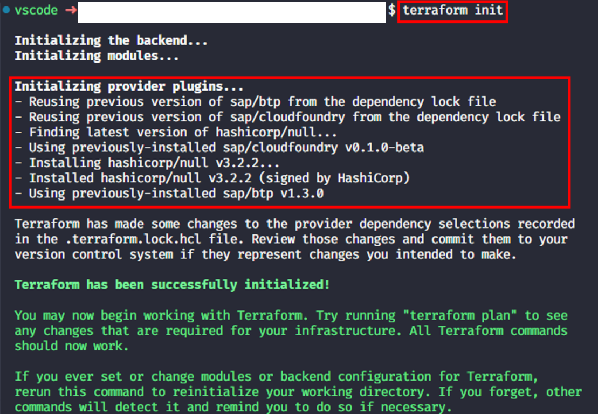
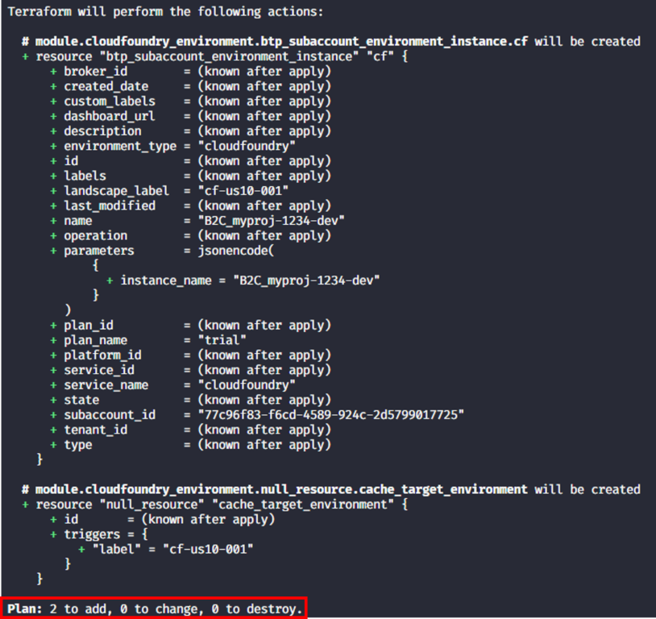
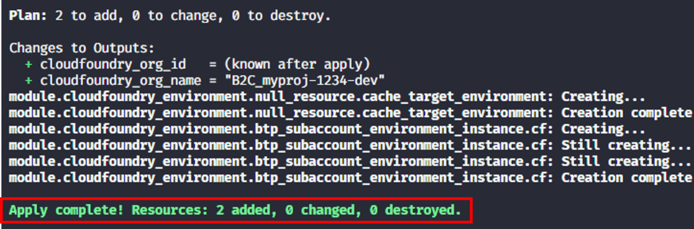
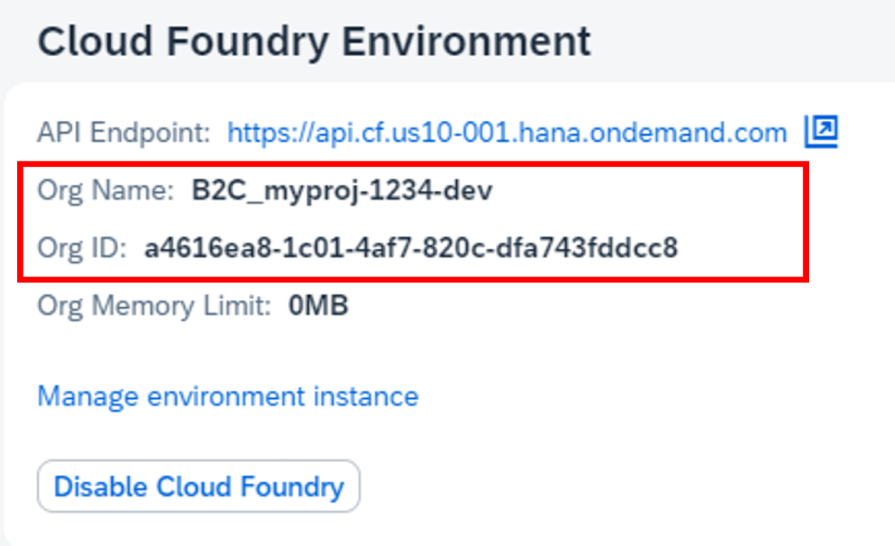
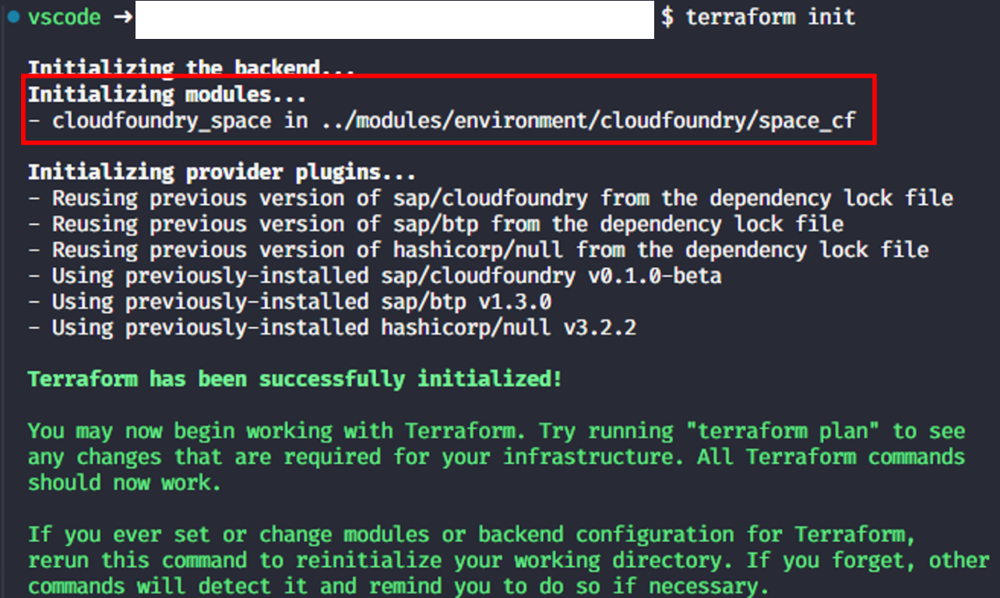
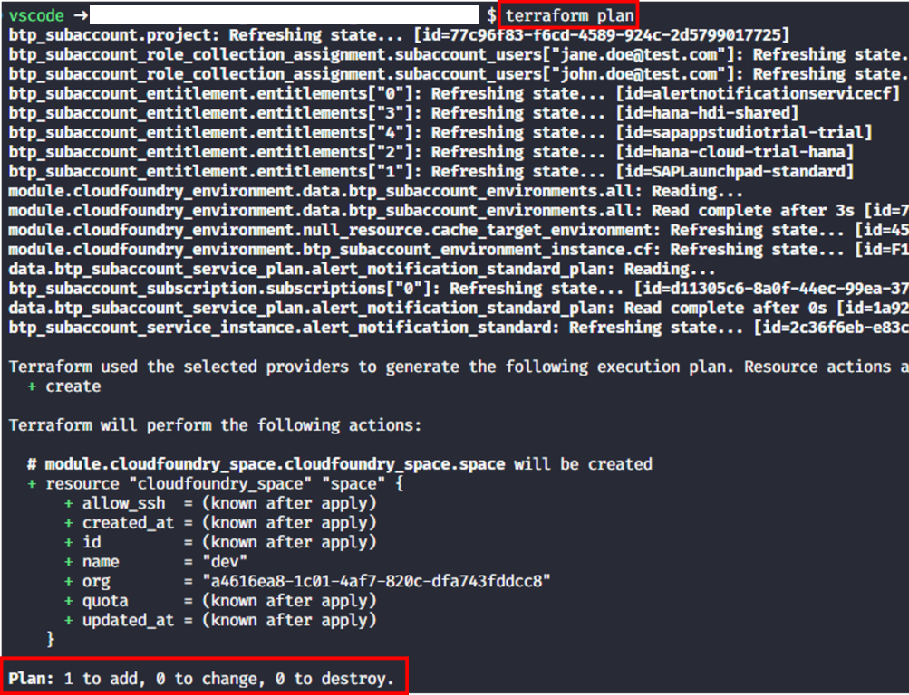
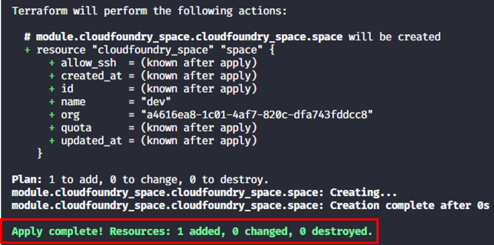
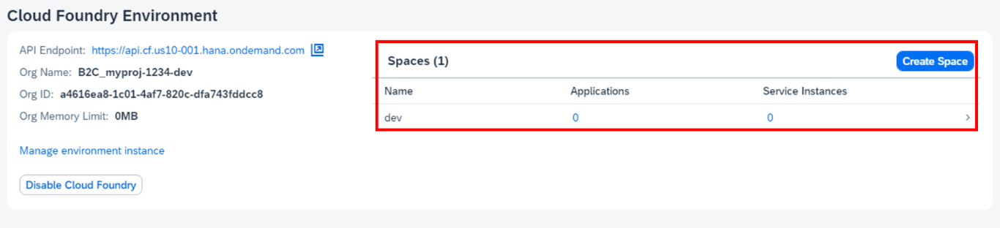

# Exercise 4 - Setup a Cloud Foundry environment

## Goal of this Exercise 🎯

In this section, we will create a Cloud Foundry environment in the subaccount using Terraform.We will define the necessary resources directly in the Terraform configuration. This approach allows us to maintain a simple structure while meeting the requirements.

## Creation of a Cloud Foundry environment

The Cloud Foundry Application Runtime service needs to be entitled to the subaccount. To achieve this, add the following resource to your Terraform configuration:

### Step 1: Add the module to the Terraform configuration

First we need to add one more local variable in the `main.tf` file. Open the `main.tf` file and add the following code to the `locals` block:

```terraform
project_subaccount_cf_org = replace("${var.org_name}_${lower(var.project_name)}-${lower(var.stage)}", " ", "_")
```
Then add the following code to the `main.tf`

```terraform
resource "btp_subaccount_entitlement" "cf_application_runtime" {
  subaccount_id = btp_subaccount.project.id
  service_name  = "APPLICATION_RUNTIME"
  plan_name     = "MEMORY"
  amount        = 1
}

resource "btp_subaccount_environment_instance" "cloudfoundry" {
  depends_on       = [btp_subaccount_entitlement.cf_application_runtime]
  subaccount_id    = btp_subaccount.project.id
  name             = local.project_subaccount_cf_org
  landscape_label  = var.cf_landscape_label
  environment_type = "cloudfoundry"
  service_name     = "cloudfoundry"
  plan_name        = "trial"
  parameters = jsonencode({
    instance_name = local.project_subaccount_cf_org
    memory        = 1024
  })
  timeouts = {
    create = "1h"
    update = "35m"
    delete = "30m"
  }
}
```

### Step 2: Adjust the output variables

As we are using the output variables of the module, we need to adjust the output variables in the `outputs.tf` file. Open the `outputs.tf` file and add the following code:

```terraform
output "cloudfoundry_org_name" {
  value       = local.project_subaccount_cf_org
  description = "The name of the cloudfoundry org connected to the project account."
}
```

We reference the output variables of the module via the `module` keyword. Save the changes.

### Step 4: Adjust the provider configuration

As we are using an additional provider we must make Terraform aware of this in the `provider.tf` file. Open the `provider.tf` file and add the following code to the `required_provider` block:

```terraform
cloudfoundry = {
      source  = "cloudfoundry/cloudfoundry"
      version = "1.1.0"
    }
```

To configure the Cloud Foundry provider add the following lines at the end of the file:

```terraform
provider "cloudfoundry" {
  api_url = "https://api.cf.${var.region}-001.hana.ondemand.com"
}
```

Save your changes.

> [!WARNING]
> We assume that the Cloud Foundry environment is deployed to the extension landscape 001. If this is not the case the authentication might fail. In a real-world scenario you would probably have a different boundary of content to the module.

To fulfill all requirements for the authentication against the Cloud Foundry environment you must export the following environment variables:

- Windows:

    ```pwsh
    $env:CF_USER=<your SAP BTP username>
    $env:CF_PASSWORD='<your SAP BTP password>'
    ```

- Linux/MacOS/GitHub Codespaces:

    ```bash
    export CF_USER=<your SAP BTP username>
    export CF_PASSWORD='<your SAP BTP password>'
    ```

> [!NOTE]
> Although we do not use the Cloud Foundry part of the module namely the assignment of users to the organization, Terraform will initialize the Cloud Foundry provider and try to authenticate against the Cloud Foundry environment. This is why we need to define the configuration and provide the credentials.

### Step 3: Apply the changes

As we have a new provider and a new module in place, we need to re-initialize the setup to download the required provider and module. Run the following command:

```bash
terraform init
```

The output should look like this:



> [!NOTE]
> There is also a command parameter called `--upgrade` for the `terraform init` command. This parameter will *upgrade* the provider to the latest version. As we are adding new providers, we do not need to use this parameter.

You know the drill by now:

1. Plan the Terraform configuration to see what will be created:

    ```bash
    terraform plan
    ```

    The output should look like this:

    

2. Apply the Terraform configuration to create the environment:

    ```bash
    terraform apply
    ```

    You will be prompted to confirm the creation of the environment. Type `yes` and press `Enter` to continue.

The result should look like this:



You can also check that everything is in place via the SAP BTP cockpit. You should see the Cloud Foundry environment in the subaccount:

 

## Creation of a Cloud Foundry space

As a last task we also want to add a Cloud Foundry space to the Cloud Foundry environment. We will use the same concept as before and leverage a module. Navigate to the `modules` folder in the root of this repo and you will find the fitting module at [environments/cloudfoundry/space_cf](../../modules/environment/cloudfoundry/space_cf/README.md).

### Step 1: Add the space name variable to the configuration

First we need to add more variable in the `variables.tf` file. Open the `variables.tf` file and add the following code:

```terraform
variable "cf_space_name" {
  type        = string
  description = "The name of the Cloud Foundry space."
  default     = "dev"
}

variable "cf_landscape_label" {
  type        = string
  description = "The region where the project account shall be created in."
  default     = "cf-us10-001"
}

variable "cf_org_name" {
  type        = string
  description = "The name for the Cloud Foundry Org."
  default     = ""
}

variable "cf_org_user" {
  type        = set(string)
  description = "Defines the colleagues who are added to each subaccount as subaccount administrators."
  default     = ["jane.doe@test.com", "john.doe@test.com"]
}

variable "cf_space_managers" {
  type        = list(string)
  description = "The list of Cloud Foundry space managers."
  default     = []
}

variable "cf_space_developers" {
  type        = list(string)
  description = "The list of Cloud Foundry space developers."
  default     = []
}

variable "cf_space_auditors" {
  type        = list(string)
  description = "The list of Cloud Foundry space auditors."
  default     = []
}
```

This allows us to specify the name of the Cloud Foundry space. We also define a default value (`dev`) for the variable. Save the changes.

### Step 2: Add the module to the Terraform configuration

To trigger the creation of a Cloud Foundry space and space roles, we add the module to the `main.tf` file. Open the `main.tf` file and add the following code:

```terraform
resource "cloudfoundry_org_role" "my_role" {
  for_each = var.cf_org_user
  username = each.value
  type     = "organization_user"
  org      = btp_subaccount_environment_instance.cloudfoundry.platform_id
}

resource "cloudfoundry_space" "space" {
  name = var.name
  org  = btp_subaccount_environment_instance.cloudfoundry.platform_id
}

resource "cloudfoundry_space_role" "cf_space_managers" {
  for_each = toset(var.cf_space_managers)
  username = each.value
  type     = "space_manager"
  space    = cloudfoundry_space.space.id
  depends_on = [ cloudfoundry_org_role.my_role ]
}

resource "cloudfoundry_space_role" "cf_space_developers" {
  for_each = toset(var.cf_space_developers)
  username = each.value
  type     = "space_developer"
  space    = cloudfoundry_space.space.id
  depends_on = [ cloudfoundry_org_role.my_role ]
}

resource "cloudfoundry_space_role" "cf_space_auditors" {
  for_each = toset(var.cf_space_auditors)
  username = each.value
  type     = "space_auditor"
  space    = cloudfoundry_space.space.id
  depends_on = [ cloudfoundry_org_role.my_role ]
}
```

Save the changes.

### Step 3: Apply the changes

As we have all prerequisites already in place when it comes to provider configuration and authentication. However, we need to reinitialize the module that we use. To achieve that run the following command:

```bash
terraform init
```

The output should look like this:



Once we have initialized the module we can proceed with the creation of the Cloud Foundry space. As before we execute the following commands:

1. Plan the Terraform configuration to see what will be created:

    ```bash
    terraform plan
    ```

    The output should look like this:

    

2. Apply the Terraform configuration to create the space:

    ```bash
    terraform apply
    ```

    You will be prompted to confirm the creation of the space. Type `yes` and press `Enter` to continue.

The result should look like this:



You can also check that everything is in place via the SAP BTP cockpit. You should see the Cloud Foundry space in the subaccount:

 

## Summary

You've now successfully created a Cloud Foundry environment instance as well as a Cloud Foundry space in SAP BTP.

Continue to - [Exercise 5 - Adding Emergency Administrators](../EXERCISE5/README.md).
