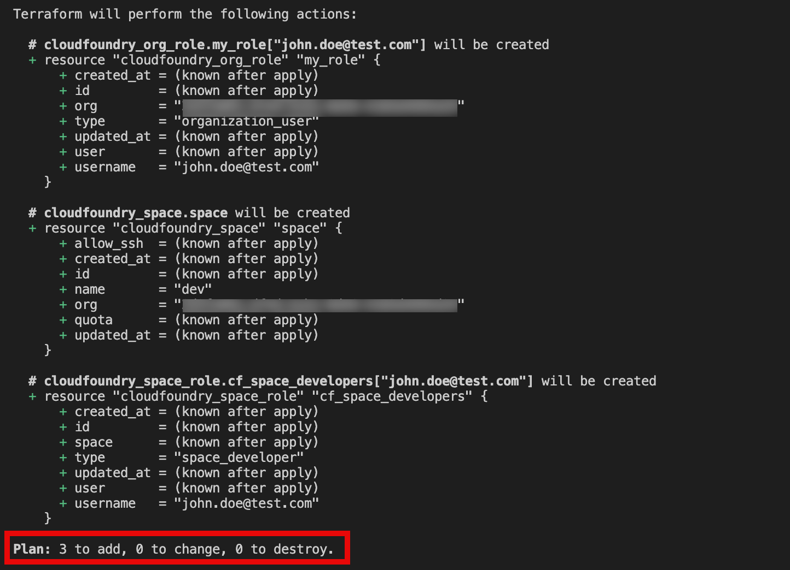
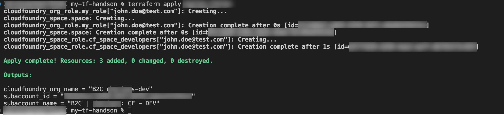
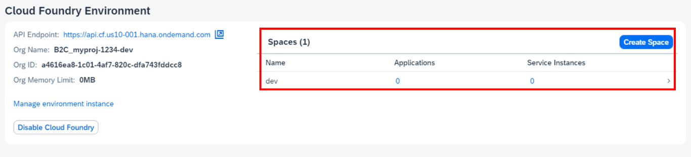

# Exercise 5 - Create a CloudFoundry Space

## Goal of this Exercise 🎯

In this exercise you will learn how to use the [Terraform Provider for CloudFoundry](https://registry.terraform.io/providers/cloudfoundry/cloudfoundry/latest/docs) and create a space.

To fulfill all requirements for the authentication against the Cloud Foundry environment you must export the following environment variables:

- Windows:

    ```pwsh
    $env:CF_USER=<your SAP BTP username>
    $env:CF_PASSWORD='<your SAP BTP password>'
    ```

- Linux/MacOS/GitHub Codespaces:

    ```bash
    export CF_USER=<your SAP BTP username>
    export CF_PASSWORD='<your SAP BTP password>'
    ```


### Step 1: Adjust the provider configuration

As we are using an additional provider we must make Terraform aware of this in the `provider.tf` file. Open the `provider.tf` file and add the following code to the `required_provider` block:

```terraform
cloudfoundry = {
      source  = "cloudfoundry/cloudfoundry"
      version = "1.1.0"
    }
```

To configure the Cloud Foundry provider add the following lines at the end of the file:

```terraform
provider "cloudfoundry" {
  api_url = "https://api.cf.${var.region}-001.hana.ondemand.com"
}
```
Save your changes.

> [!WARNING]
> We assume that the Cloud Foundry environment is deployed to the extension landscape 001. If this is not the case the authentication might fail. In a real-world scenario you would probably have a different boundary of content to the module.


> [!NOTE]
> Although we do not use the Cloud Foundry part of the module namely the assignment of users to the organization, Terraform will initialize the Cloud Foundry provider and try to authenticate against the Cloud Foundry environment. This is why we need to define the configuration and provide the credentials.


### Step 2: Add the variable to the configuration for Space creation

First we need to add more variable in the `variables.tf` file. Open the `variables.tf` file and add the following code:

```terraform
variable "cf_space_name" {
  type        = string
  description = "The name of the Cloud Foundry space."
  default     = "dev"
}

variable "cf_org_user" {
  type        = set(string)
  description = "Defines the colleagues who are added to each subaccount as subaccount administrators."
  default     = ["jane.doe@test.com", "john.doe@test.com"]
}

variable "cf_space_managers" {
  type        = list(string)
  description = "The list of Cloud Foundry space managers."
  default     = []
}

variable "cf_space_developers" {
  type        = list(string)
  description = "The list of Cloud Foundry space developers."
  default     = []
}

variable "cf_space_auditors" {
  type        = list(string)
  description = "The list of Cloud Foundry space auditors."
  default     = []
}
```

This allows us to specify the name of the Cloud Foundry space. We also define a default value (`dev`) for the variable. Save the changes.

### Step 3: Cloudfoundry Space Creation and Role Assignments

To trigger the creation of a Cloud Foundry space and space roles, Open the `main.tf` file and add the following code:

```terraform
resource "cloudfoundry_org_role" "my_role" {
  for_each = var.cf_org_user
  username = each.value
  type     = "organization_user"
  org      = btp_subaccount_environment_instance.cloudfoundry.platform_id
}

resource "cloudfoundry_space" "space" {
  name = var.cf_space_name
  org  = btp_subaccount_environment_instance.cloudfoundry.platform_id
}

resource "cloudfoundry_space_role" "cf_space_managers" {
  for_each = toset(var.cf_space_managers)
  username = each.value
  type     = "space_manager"
  space    = cloudfoundry_space.space.id
  depends_on = [ cloudfoundry_org_role.my_role ]
}

resource "cloudfoundry_space_role" "cf_space_developers" {
  for_each = toset(var.cf_space_developers)
  username = each.value
  type     = "space_developer"
  space    = cloudfoundry_space.space.id
  depends_on = [ cloudfoundry_org_role.my_role ]
}

resource "cloudfoundry_space_role" "cf_space_auditors" {
  for_each = toset(var.cf_space_auditors)
  username = each.value
  type     = "space_auditor"
  space    = cloudfoundry_space.space.id
  depends_on = [ cloudfoundry_org_role.my_role ]
}
```

### Step 4: Add the variables to tfvar file

Now we can add `space developers` and `space managers` to the space we created, Add following variables to your `tfvars` file.

```terraform
cf_org_user   = ["john.doe@test.com"]     
cf_space_developers = ["john.doe@test.com"]
```
Save the changes.

### Step 5: Apply the changes
As we have all prerequisites already in place when it comes to provider configuration and authentication, we can proceed with applying the changes.

1. As we have a new provider in place, we need to re-initialize the setup to download the required provider and module. Run the following command:

  ```bash
  terraform init
  ```

2. Plan the Terraform configuration to see what will be created:

    ```bash
    terraform plan
    ```

    The output should look like this:

    

3. Apply the Terraform configuration to create the space:

    ```bash
    terraform apply
    ```

    You will be prompted to confirm the creation of the space. Type `yes` and press `Enter` to continue.

The result should look like this:



You can also check that everything is in place via the SAP BTP cockpit. You should see the Cloud Foundry space in the subaccount:

 

## Summary

You've now successfully created a Cloud Foundry environment instance as well as a Cloud Foundry space in SAP BTP.

Continue to - [Exercise 6 - Cleanup](../EXERCISE6/README.md).