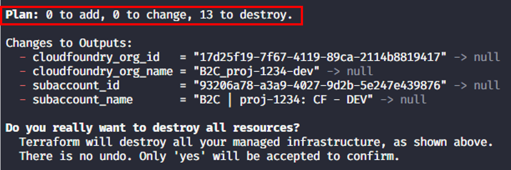
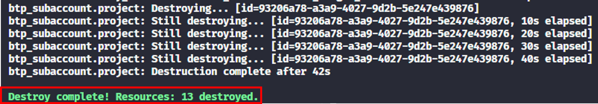

# Exercise 6 - Cleanup

## Goal of this Exercise 🎯

The goal of this exercise is to delete the resources that were created in the previous exercises. This is important to avoid unnecessary costs and to keep the environment clean.

## Step 1: Trigger the deletion of the resources

You can delete the resources by running the following command:

```bash
terraform destroy
```

The output of the command will look similar to this:


Take also a look at the summary. This will show how the number of resources to be deleted:



Terraform will calculate the changes it will execute, namely the deletion of the resources. You will be prompted to confirm the deletion. Check the output of the plan. Type `yes` and hit `Enter` to confirm the deletion.

This will now recursively delete all resources that were created by Terraform. This might take a bit of time. At the end you should see a message like this:



## Step 2: Verify the deletion of the resources

After the deletion was executed successfully, verify that the resources were deleted. You can check the status of the resources in the SAP BTP cockpit.

## Step 3: Check the Terraform state

After the deletion of the resources, check the Terraform state. Walk through the following questions:

- Did the state file disappear or is it still there?
- If it is still there what is the content of the state file?

> [!TIP]
> You can also use the `terraform state list` command to inspect the state of the resources. You find more information about that command in the [Terraform documentation](https://developer.hashicorp.com/terraform/cli/state/inspect).

## Summary

Congrats - you've successfully completed the HandsOn. You've now learned how to use Terraform to manage resources in SAP BTP, how to deal with drift and also how to delete the resources again.

If you'd like to review some Terraform sample scripts, we've published them in the following repository for your reference.

```bash
git clone https://github.com/SAP-samples/btp-terraform-samples.git
```

you can find the exercises in the folder `released`.

Happy Terraforming!
