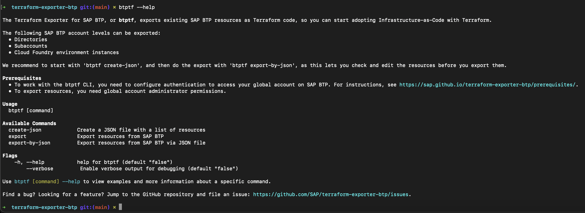
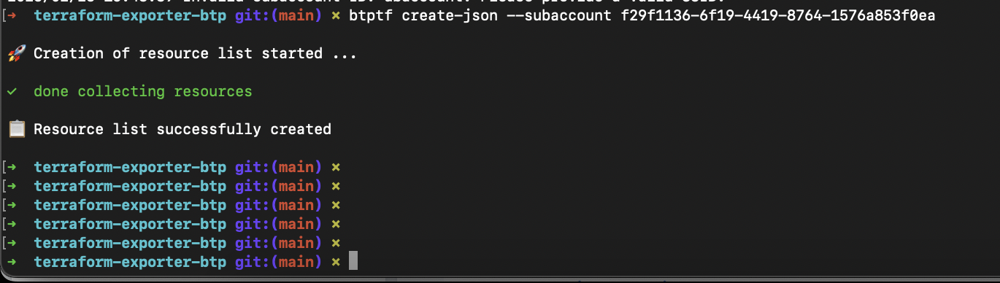
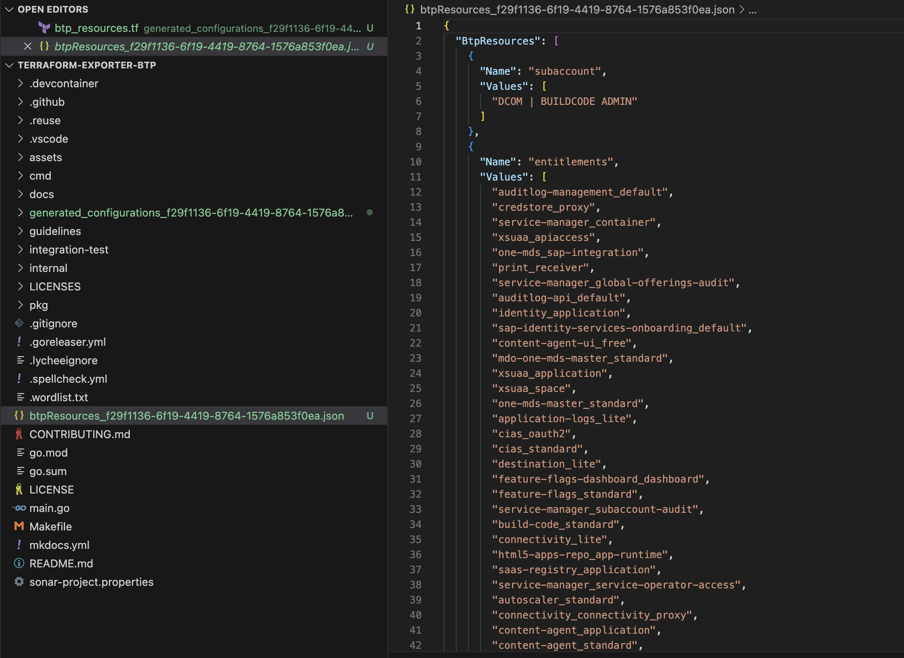
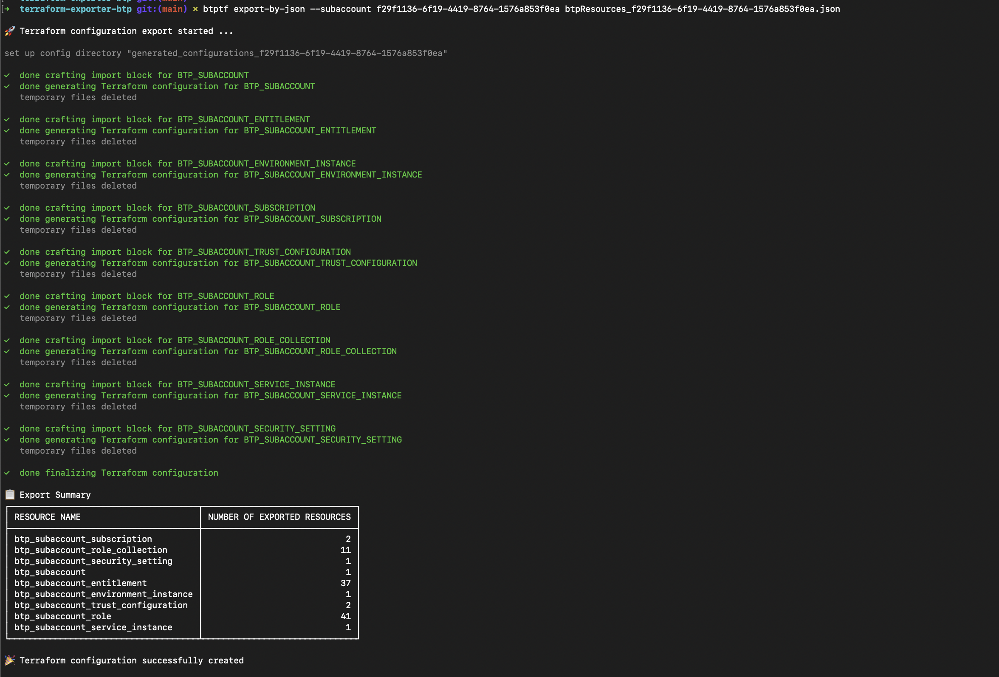

# SITBLR MARCH 2025 - Make BTP Account management a breeze with Terraform Exporter

In this Handson session you will discover how the BTP Terraform Exporter can swiftly bring any SAP BTP subaccount under terraform life cycle.Imagine managing your infrastructure entirely through declarative HCL by running terraform commands to handle the state changes.Now, picture doing that even when your subaccount is already running a Cloudfoundry runtime with active services.

With BTP Terraform Exporter, you can effortlessly import and manage those resources without writing a single line of code.

## Goal of this Exercise 🎯

In this hands-on exercise you will learn how to use the [BTP Terraform Exporter](https://sap.github.io/terraform-exporter-btp/) to make existing SAP Business Technology Platform resources into Terraform.

## Prerequisites

  - You need one SAP BTP Subaccount.
  - [Terraform CLI](https://developer.hashicorp.com/terraform/install?product_intent=terraform)
  - [btptf CLI](https://sap.github.io/terraform-exporter-btp/install/)

## Exporting environment variables

The last step in the setup is the export of the environment variables that are required to authenticate against the Terraform provider for SAP BTP. For that export the following environment variables:

- Windows:

    ```pwsh
    $env:BTP_USERNAME=<your SAP BTP username>
    $env:BTP_PASSWORD='<your SAP BTP password>'
    $env:CF_USER=<your SAP BTP username>
    $env:CF_PASSWORD='<your SAP BTP password>'
    ```

- Linux/MacOS/GitHub Codespaces:

    ```bash
    export BTP_USERNAME=<your SAP BTP username>
    export BTP_PASSWORD='<your SAP BTP password>'
    export CF_USERNAME=<your SAP BTP username>
    export CF_PASSWORD='<your SAP BTP password>'
    ```

Validate that the values are set via:

- Windows: `$env:BTP_USERNAME` and `$env:BTP_PASSWORD`
- Linux/MacOS/GitHub Codeapses: `echo $BTP_USERNAME` and `echo $BTP_PASSWORD`

## Step 1: Create a new directory

To make use of Terraform you must create several configuration files using the [Terraform configuration language](https://developer.hashicorp.com/terraform/language). Create a new directory named `my-tf-handson` under the folder `SITBLR2025`.

Terraform expects a specific file layout for its configurations. Create the following empty files in the directory `my-tf-handson`:

- `main.tf` - this file will contain the main configuration of the Terraform setup
- `provider.tf` - this file will contain the provider configuration
- `variables.tf` - this file will contain the variables to be used in the Terraform configuration
- `terraform.tfvars` - this file will contain your specific variable values

## Step 2: Setup Subaccount using Terraform

In this exercise you will learn how to use the [Terraform Provider for SAP BTP](https://registry.terraform.io/providers/SAP/btp/latest/docs) to provision and manage resources in SAP BTP as well as [Cloudfoundry Terraform Provider](https://registry.terraform.io/providers/cloudfoundry/cloudfoundry/latest) to manage Cloudfoundry resources.

- Open the file `provider.tf` and add the following content:

```terraform
terraform {
  required_providers {
    btp = {
      source  = "sap/btp"
      version = "~> 1.10.0"
    }
    cloudfoundry = {
      source  = "cloudfoundry/cloudfoundry"
      version = "~> 1.3.0"
    }
  }
}

provider "btp" {
  globalaccount = var.globalaccount
  idp           = var.idp
}
provider "cloudfoundry" {
  api_url = "https://api.cf.${var.region}.hana.ondemand.com"
  origin  = var.idp
}
```

What have we done? First we defined which provider we want to use and which version of the provider we want to use. In this case we want to use the provider `sap/btp` in version `1.10.0` and cloudfoundry provider `cloudfoundry/cloudfoundry` in version `1.3.0`. Then we defined the provider configuration. In this case we need to provide the `globalaccount` and `idp` parameters where we reference a variable. We will define this variable in the next step.

 > [!NOTE]
 > We do not need any authentication information in this file. We provided the authentication information via environment variables.

Next we must add the required variables to the `variables.tf` file. Open the file `variables.tf` and add the following content:

```terraform
variable "globalaccount" {
  type        = string
  description = "The subdomain of the SAP BTP global account."
}

variable "idp" {
  type        = string
  description = "Orgin key of Identity Provider"
  default     = null
}
variable "region" {
  type        = string
  description = "The region where the project account shall be created in."
  default     = "eu10"
}
variable "project_name" {
  type        = string
  description = "The subaccount name."
  default     = "proj-1234"

  validation {
    condition     = can(regex("^[a-zA-Z0-9_\\-]{1,200}", var.project_name))
    error_message = "Provide a valid project name."
  }
}
variable "stage" {
  type        = string
  description = "The stage/tier the account will be used for."
  default     = "DEV"

  validation {
    condition     = contains(["DEV", "TST", "PRD"], var.stage)
    error_message = "Select a valid stage for the project account."
  }
}
variable "costcenter" {
  type        = string
  description = "The cost center the account will be billed to."
  default     = "1234567890"

  validation {
    condition     = can(regex("^[0-9]{10}", var.costcenter))
    error_message = "Provide a valid cost center."
  }
}
variable "org_name" {
  type        = string
  description = "Defines to which organization the project account shall belong to."
  default     = "HandsOn"
}
variable "bas_admins" {
  type        = list(string)
  description = "List of users to assign the Administrator role."

}
variable "bas_developers" {
  type        = list(string)
  description = "List of users to assign the Developer role."
}
variable "bas_service_name" {
  type        = string
  description = "Service name for Business Application Studio."
  default     = "sapappstudio"

}
variable "bas_plan" {
  type        = string
  description = "Plan name for Business Application Studio."
  default     = "standard-edition"
}

variable "cf_landscape_label" {
  type        = string
  description = "The region where the project account shall be created in."
  default     = "cf-eu10"
}
variable "cf_plan" {
  type        = string
  description = "Plan name for Cloud Foundry Runtime."
  default     = "standard"
}
variable "cf_space_name" {
  type        = string
  description = "The name of the Cloud Foundry space."
  default     = "dev"
}

variable "cf_org_user" {
  type        = set(string)
  description = "Defines the colleagues who are added to each subaccount as subaccount administrators."
  default     = ["jane.doe@test.com", "john.doe@test.com"]
}

variable "cf_space_managers" {
  type        = list(string)
  description = "The list of Cloud Foundry space managers."
  default     = []
}

variable "cf_space_developers" {
  type        = list(string)
  description = "The list of Cloud Foundry space developers."
  default     = []
}

variable "cf_space_auditors" {
  type        = list(string)
  description = "The list of Cloud Foundry space auditors."
  default     = []
}
```
We have now defined the variables which will be required for the provider configuration. We will provide the value for this variable via the `terraform.tfvars` file. 

 - Open the file `terraform.tfvars` and add the following content:

```terraform
globalaccount = "<YOUR GLOBAL ACCOUNT SUBDOMAIN>"
idp = null
project_name  = "<YOUR LAST NAME>"

bas_service_name = "sapappstudio" 
bas_plan = "standard-edition"
bas_admins = ["admin1@example.com", "admin2@example.com"]
bas_developers = ["dev1@example.com", "dev2@example.com"]

cf_plan = "standard" 
cf_org_user   = ["john.doe@test.com"]     
cf_space_developers = ["john.doe@test.com"]
```
The SAP BTP Global Account Subdomain can be found in the SAP BTP Cockpit.

As all bits and pieces are in place we can now create the subaccount configuration.

- Open `main.tf` file and add the following content

```terraform
locals {
  project_subaccount_name   = "${var.org_name} | ${var.project_name}: CF - ${var.stage}"
  project_subaccount_domain = lower(replace("${var.org_name}-${var.project_name}-${var.stage}", " ", ""))
  project_subaccount_cf_org = replace("${var.org_name}_${lower(var.project_name)}-${lower(var.stage)}", " ", "_")
}
resource "btp_subaccount" "project" {
  name      = local.project_subaccount_name
  subdomain = local.project_subaccount_domain
  region    = lower(var.region)
  labels = {
    "stage"      = ["${var.stage}"],
    "costcenter" = ["${var.costcenter}"]
  }
}
resource "btp_subaccount_entitlement" "bas" {
  subaccount_id = btp_subaccount.project.id
  service_name  = var.bas_service_name
  plan_name     = var.bas_plan
}

resource "btp_subaccount_subscription" "bas" {
  subaccount_id = btp_subaccount.project.id
  app_name      = var.bas_service_name
  plan_name     = var.bas_plan
  depends_on    = [btp_subaccount_entitlement.bas]
}

resource "btp_subaccount_role_collection_assignment" "bas_admin" {
  for_each             = toset(var.bas_admins)
  subaccount_id        = btp_subaccount.project.id
  role_collection_name = "Business_Application_Studio_Administrator"
  user_name            = each.value
  depends_on           = [btp_subaccount_subscription.bas]
}

resource "btp_subaccount_role_collection_assignment" "bas_developer" {
  for_each             = toset(var.bas_developers)
  subaccount_id        = btp_subaccount.project.id
  role_collection_name = "Business_Application_Studio_Developer"
  user_name            = each.value
  depends_on           = [btp_subaccount_subscription.bas]
}
resource "btp_subaccount_environment_instance" "cloudfoundry" {
  subaccount_id    = btp_subaccount.project.id
  name             = local.project_subaccount_cf_org
  landscape_label  = var.cf_landscape_label
  environment_type = "cloudfoundry"
  service_name     = "cloudfoundry"
  plan_name        = var.cf_plan
  parameters = jsonencode({
    instance_name = local.project_subaccount_cf_org
  })
  timeouts = {
    create = "1h"
    update = "35m"
    delete = "30m"
  }
}
resource "cloudfoundry_org_role" "my_role" {
  for_each = var.cf_org_user
  username = each.value
  type     = "organization_user"
  org      = btp_subaccount_environment_instance.cloudfoundry.platform_id
}

resource "cloudfoundry_space" "space" {
  name = var.cf_space_name
  org  = btp_subaccount_environment_instance.cloudfoundry.platform_id
}

resource "cloudfoundry_space_role" "cf_space_managers" {
  for_each   = toset(var.cf_space_managers)
  username   = each.value
  type       = "space_manager"
  space      = cloudfoundry_space.space.id
  depends_on = [cloudfoundry_org_role.my_role]
}

resource "cloudfoundry_space_role" "cf_space_developers" {
  for_each   = toset(var.cf_space_developers)
  username   = each.value
  type       = "space_developer"
  space      = cloudfoundry_space.space.id
  depends_on = [cloudfoundry_org_role.my_role]
}

resource "cloudfoundry_space_role" "cf_space_auditors" {
  for_each   = toset(var.cf_space_auditors)
  username   = each.value
  type       = "space_auditor"
  space      = cloudfoundry_space.space.id
  depends_on = [cloudfoundry_org_role.my_role]
}
```
### Apply the Terraform configuration

Now the moment has come to apply the Terraform configuration for the first time. Open a terminal window and execute the following commands:

1. Initialize the Terraform configuration to download the required provider:

```bash
terraform init
```

> [!NOTE]
> Check your files. You should have a new folder called `.terraform` as well as new file called `.terraform.lock.hcl` in your directory. This means that the Terraform provider has been successfully downloaded and the version constraints are stored for your setup.

2. Plan the Terraform configuration to see what will be created:

```bash
terraform plan
```
3. Apply the Terraform configuration to create the subaccount:

```bash
terraform apply

```
 You will be prompted to confirm the creation of the subaccount. Type `yes` and press `Enter` to continue.

You've now successfully created a SAP BTP Subaccount with active resources, We will export this Subaccount using BTP Terraform exporter

## Step2: Export BTP Subaccount Using BTP Terraform Exporter.

The BTP Terraform provider is useful when you need to create a BTP Subaccount from scratch. However, if you already have an existing Subaccount and want to manage it using Terraform, you can use the Terraform Exporter.

The Terraform Exporter for SAP BTP (btptf CLI) is a convenient tool that simplifies the process of importing your existing SAP Business Technology Platform (BTP) resources into Terraform.

Pre-requisites:

- you need one existing BTP subaccount with resources in it (You already have one now).
- [Terraform Exporter Binaries](https://github.com/SAP/terraform-exporter-btp), Run the below command in your cli to check the exporter binaries have setup.

```bash
  btptf --help
 ```
 You should see below output.

 

- If exporter is not avaialble, Go to [Setup Terraform Exporter](https://sap.github.io/terraform-exporter-btp/install/)

## Get the list of resources of a Subaccount in a JSON file

- Copy the subaccount ID you have created, And run the below command

```bash
btptf create-json --subaccount <Your Subaccount ID>
```
This command will create a file named `btp_resource_<subaccount_id>.json`

 You should see the following output:

 

If you want any of the resources (Entitlements, Role collections, Roles, etc) to be excluded from the Subaccount that you are going to export, Remove them from the `btp_resource_<subaccount_id>.json`.

You should see the `btp_resource_<subaccount_id>.json` like below:


 
## Generate configuration for Export

- If you are ready with updated Json, Run the below command to start exporting the resources.

```bash
btptf export-by-json --subaccount <subaccount ID> --path '</path/to/the/file>'
```

You have generated the terraform scripts now, you could see the scripts under `generated_configurations_<subaccount_id>` named directory.

You should see the following output:



## Export the resources

You can go the the `generated_configurations` folder, There you will see all the generated scripts.

Run the below command to bring the required subaccount resources under the management of terraform.

```bash
terraform apply
```
You should see the below output:


Now all the resources are exported and you can see the stae file under the folder `generated_configurations_<subaccount_id>`

> [!TIP]
> If you do not want to use Json file input, You can also use the `btptf export -S <subaccount_id>` command to export all the resources under one Subaccount.

### Summary

Congratulations! You have successfully completed the hands-on exercise.

This demonstrates how the BTP Terraform Exporter can be used to bring an existing BTP Subaccount under Terraform management. Without this tool, these tasks would be cumbersome and prone to errors.

### For Further References

Vist below links

- https://learning.sap.com/learning-journeys/getting-started-with-terraform-on-sap-btp

If you'd like to review some Terraform sample scripts, we've published them in the following repository for your reference.

```bash
git clone https://github.com/SAP-samples/btp-terraform-samples.git
```

you can find the exercises in the folder `released`.

Happy Terraforming!

