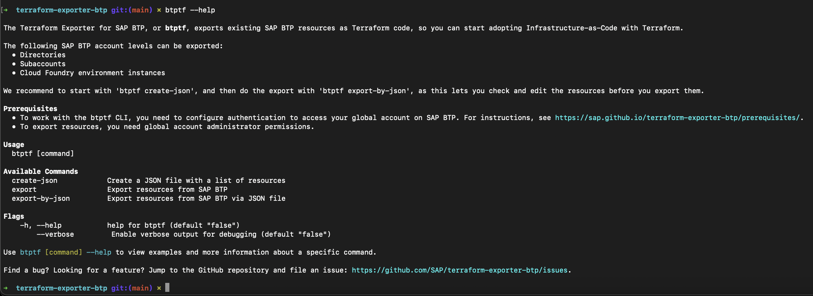
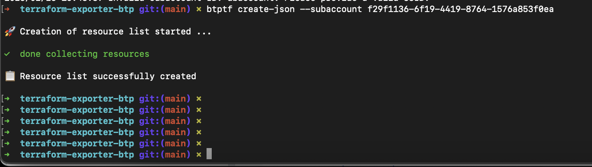
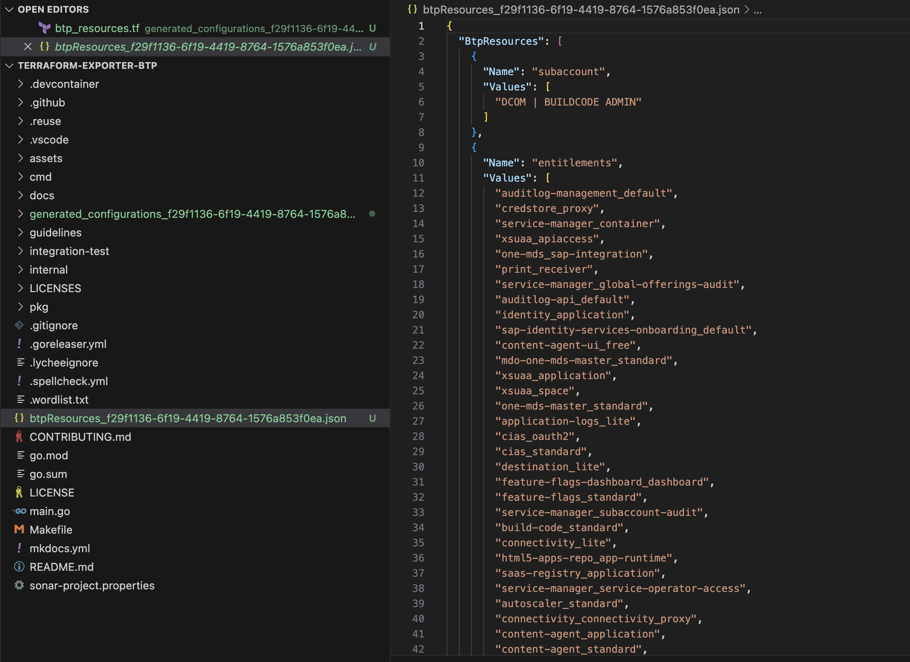
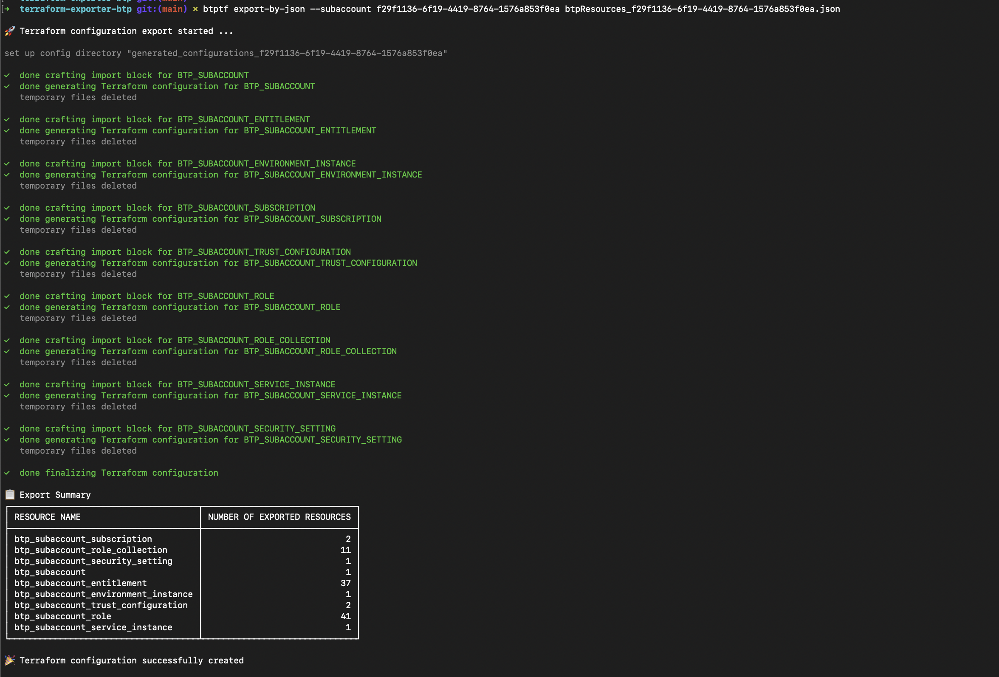
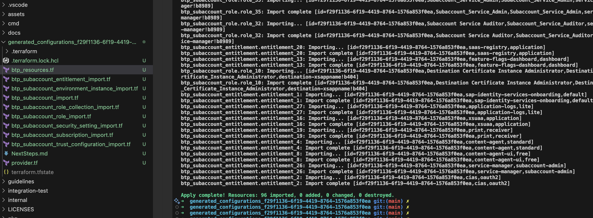
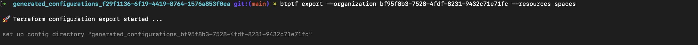

## Step2: Export BTP Subaccount Using BTP Terraform Exporter.

The BTP Terraform provider is useful when you need to create a BTP Subaccount from scratch. However, if you already have an existing Subaccount and want to manage it using Terraform, you can use the Terraform Exporter.

The Terraform Exporter for SAP BTP (btptf CLI) is a convenient tool that simplifies the process of importing your existing SAP Business Technology Platform (BTP) resources into Terraform.

Pre-requisites:

- you need one existing BTP subaccount with resources in it (You already have one now).
- [Terraform Exporter Binaries](https://github.com/SAP/terraform-exporter-btp/releases), Run the below command in your cli to check the exporter binaries have setup.

```bash
  btptf --help
 ```
 You should see below output.

 ## Exporting environment variables

The last step in the setup is the export of the environment variables that are required to function BTP Terraform Exporter. For that export the following environment variables:

- Windows:

    ```pwsh
    $env:BTP_GLOBALACCOUNT=<your SAP BTP Global Account subdomain>
    $env:BTP_CLI_SERVER_URL="https://cpcli.cf.eu10.hana.ondemand.com"
    $env:CF_API_URL="https://api.cf.ap10.hana.ondemand.com"
    ```

- Linux/MacOS/GitHub Codespaces:

    ```bash
    export BTP_GLOBALACCOUNT=<your SAP BTP Global Account subdomain>
    export BTP_CLI_SERVER_URL="https://cpcli.cf.eu10.hana.ondemand.com"
    export CF_API_URL="https://api.cf.ap10.hana.ondemand.com"
    ```

 

- If exporter is not avaialble, Go to [Setup Terraform Exporter](https://sap.github.io/terraform-exporter-btp/install/)

## Get the list of resources of a Subaccount in a JSON file

- Copy the subaccount ID you have created, And run the below command

```bash
btptf create-json --subaccount < Your Subaccount ID >
```
This command will create a file named `btp_resource_<subaccount_id>.json`

 You should see the following output:

 

If you want any of the resources (Entitlements, Role collections, Roles, etc) to be excluded from the Subaccount that you are going to export, Remove them from the `btp_resources_<subaccount_id>.json`.

You should see the `btp_resource_<subaccount_id>.json` like below:


 
## Generate configuration for Export

- If you are ready with updated Json, Run the below command to start exporting the resources.

```bash
btptf export-by-json --subaccount <subaccount ID> --path '</path/to/the/file>'
```

You have generated the terraform scripts now, you could see the scripts under `generated_configurations_<subaccount_id>` named directory.

You should see the following output:



## Export the BTP resources

You can go the the `generated_configurations` folder, There you will see all the generated scripts.

Run the below command to bring the required subaccount resources under the management of terraform.

```bash
terraform apply
```
You should see the below output:



Now all the resources are exported and you can see the state file under the folder `generated_configurations_<subaccount_id>`

> [!TIP]
> If you do not want to use Json file input, You can also use the `btptf export -S <subaccount_id>` command to export all the resources under one Subaccount.

## Export Cloudfoundry resources

  To export Cloud Foundry resources, we use the Organization's ID.

  As we did in the previous BTP export, we will first create the JSON file. However, this time, we only want to export the spaces. To achieve this, run the following command:

  ```bash
  btptf export --organization < Organization ID >  --resources spaces
  ```
  You should see the below output:



This command will generate the configuration files under `generated_configurations_<organization_ID>`.

In this case, we are exporting all spaces from the Cloud Foundry organization without needing to provide a JSON file as input.


### Summary

Congratulations! You have successfully completed the hands-on exercise.

This demonstrates how the BTP Terraform Exporter can be used to bring an existing BTP Subaccount under Terraform management. Without this tool, managing these tasks would be cumbersome and more susceptible to errors.

### For Further References

Vist below links

- https://github.com/SAP/terraform-exporter-btp.git

- https://learning.sap.com/learning-journeys/getting-started-with-terraform-on-sap-btp

If you'd like to review some Terraform sample scripts, we've published them in the following repository for your reference.

```bash
git clone https://github.com/SAP-samples/btp-terraform-samples.git
```

you can find the exercises in the folder `released`.

Happy Terraforming!

