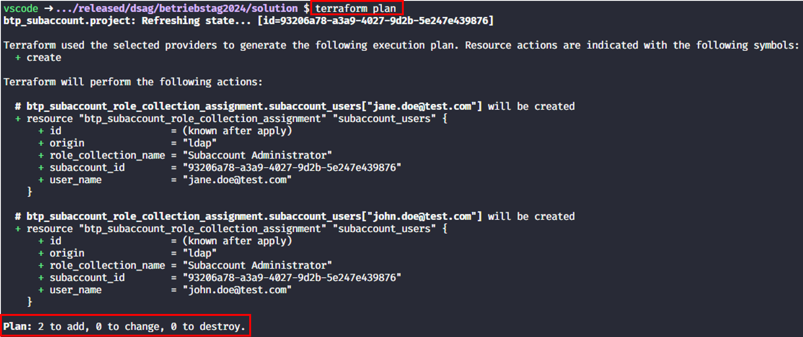
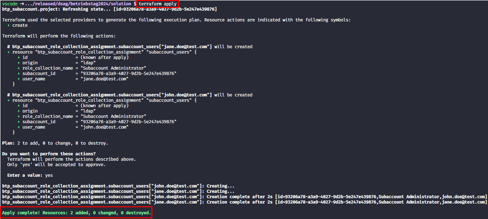
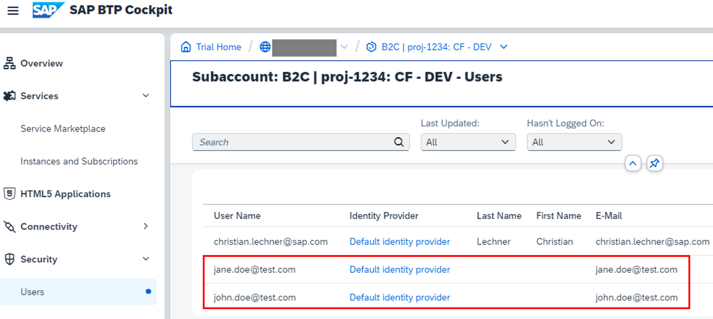

# Exercise 3 - Assignment of subaccount emergency administrators

## Goal of this Exercise 🎯

In this exercise you will learn how to assign users to role collections in the subaccount. We assume that for each subaccount we want to add emergency administrators to the role collection `Subacount Administrator`.

## Assign role collection to users

### Step 1: Enhance the variables

First we need to enhance the `variables.tf` file to add the new variable `emergency_admins`. This variable will be used to define the list of users that will be assigned to the role collection `Subaccount Administrator`. Open the `variables.tf` file and add the following code:

```terraform
variable "emergency_admins" {
  type        = list(string)
  description = "Defines the colleagues who are added to each subaccount as emergency administrators."
  default     = ["jane.doe@test.com", "john.doe@test.com"]
}
```

As you can see, the variable type can be a complex one. In this case, it is a list of strings. We define a default value for the variable, which is a list of dummy two email addresses.

This variable will be used in the next step to assign the users to the role collection. Save the changes.

### Step 2: Add the role collection configuration

Now we need to add the configuration to assign the users to the role collection. We use the resource [btp_subaccount_role_collection_assignment](https://registry.terraform.io/providers/SAP/btp/latest/docs/resources/subaccount_role_collection_assignment) to achieve this.
In addition we must iterate through the list of names and assign each user to the role collection. Open the `main.tf` file and add the following code:

```terraform
resource "btp_subaccount_role_collection_assignment" "subaccount_users" {
  for_each             = toset(var.emergency_admins)
  subaccount_id        = btp_subaccount.project.id
  role_collection_name = "Subaccount Administrator"
  user_name            = each.value
}
```

To create a resource for our user we make use of the [`for_each`](https://developer.hashicorp.com/terraform/language/meta-arguments/for_each) meta-argument provided by Terraform. This allows us to create a resource for each element in the list of users. The `for_each` argument works on a map or a set, so we must transform our list of strings into a set via the [`toset`](https://www.terraform.io/docs/language/functions/toset.html) function. We access the value of the current iteration via `each.value`. The `subaccount_id` is set to the id of the subaccount we created in the previous exercise.

> [!NOTE]
> How does Terraform know that it first needs to create the subaccount and then assign the users to the role collection? Terraform automatically detects this dependency as we are using the output of the subaccount creation namely the `btp_subaccount.project.id` as parameter for the role collection assignment. Due to this Terraform knows that the role collection assignment can only be created after the subaccount has been created and creates a corresponding execution plan. Sometimes you must explicitly model this dependency and we will see how to that in [exercise 5](../EXERCISE5/README.md).

That is already all we need to do. Save the changes.

### Step 3: Apply the changes

Now we can apply the changes to our subaccount. Run the following commands:

> [!NOTE]
> As we did not change the configuration of the provider or add any Terraform [modules](https://developer.hashicorp.com/terraform/language/modules), we do not need to run `terraform init` again.

1. Plan the Terraform configuration to see what will be created:

    ```bash
    terraform plan
    ```

    You should see the following output:

    

2. Apply the Terraform configuration to create the assignment of the role collections:

    ```bash
    terraform apply
    ```

    You will be prompted to confirm the creation the assignment of the role collections. Type `yes` and press `Enter` to continue. You should see the following output:

    

You can also check that everything is in place via the SAP BTP cockpit. You should see the assigned users in the role collection `Subaccount Administrator`:



## Summary

You've now successfully assigned emergency administrators to the subaccount.  

Continue to - [# Exercise 4 - Assign entitlements to a subaccount](../EXERCISE4/README.md).
