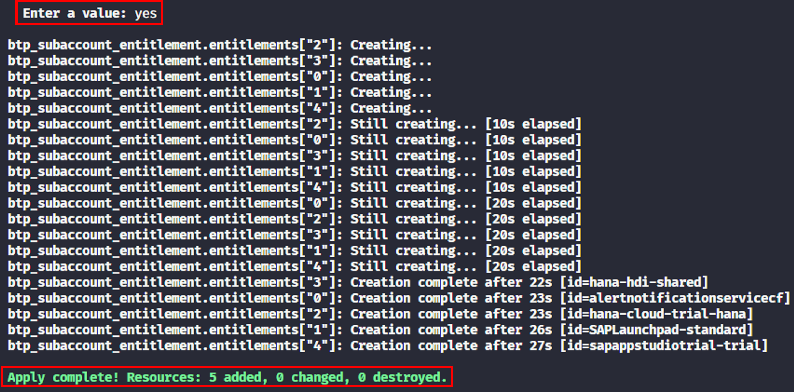

# Exercise 4 - Assign entitlements to a subaccount

## Goal of this Exercise 🎯

In this exercise, you will learn how to assign entitlements to a subaccount using Terraform. In addition, you will learn how to work with complex variables.

## Entitle the subaccount

## Step 1: Enhance the variables

Our goal is to have one variable that contains the list of entitlements that we want to assign to the subaccount. An entitlement is an object that consists of several attributes, such as the service name, the plan name, and if necessary the amount.
We will define the variable `entitlements` in the `variables.tf` file. Open the `variables.tf` file and add the following code:

```terraform
variable "entitlements" {
  type = list(object({
    name   = string
    plan   = string
    amount = number
  }))
  description = "List of entitlements for the subaccount."
  default     = []
}
```

We define a complex variable type, which is a [list](https://developer.hashicorp.com/terraform/language/expressions/types#lists-tuples) of [objects](https://developer.hashicorp.com/terraform/language/expressions/types#maps-objects). Each object has three attributes: `name`, `plan`, and `amount`. The `name` and `plan` attributes are strings, and the `amount` attribute is a number. We define a default value for the variable, which is an empty list.We will provide values for this parameter via the file `terraform.tfvars` in the next step. Save the changes.

## Step 2: Add the variable to the tfvars file

Now we need to specify the entitlements we want to create to the `terraform.tfvars` file.

We want to add the following entitlements to the subaccount:

- `alert-notification` service with the `standard` plan
- `SAPLaunchpad` application with the `standard` plan
- `hana-cloud-trial` service with the `hana` plan
- `hana` service with the `hdi-shared` plan
- `sapappstudiotrial` application with the `trial` plan

Open the `terraform.tfvars` file and add the following code:

```terraform
entitlements = [
  {
    name   = "alert-notification"
    plan   = "standard"
    amount = null
  },
  {
    name   = "SAPLaunchpad"
    plan   = "standard"
    amount = null
  },
  {
    name   = "hana-cloud-trial"
    plan   = "hana"
    amount = null
  },
  {
    name   = "hana"
    plan   = "hdi-shared"
    amount = null
  },
  {
    name   = "sapappstudiotrial"
    plan   = "trial"
    amount = null
  }
]
```

As you can see, we define a list of objects, where each object has the attributes `name`, `plan`, and `amount`. We set the `amount` attribute to `null` for all entitlements. Save the changes.

## Step 3: Add the entitlements configuration

As we have the variable and the values for the entitlements in place, we can now add the configuration to assign the entitlements to the subaccount. We use the resource [btp_subaccount_entitlement](https://registry.terraform.io/providers/SAP/btp/latest/docs/resources/subaccount_entitlement) to achieve this. Open the `main.tf` file and add the following code:

```terraform
resource "btp_subaccount_entitlement" "entitlements" {
  for_each = {
    for index, entitlement in var.entitlements :
    index => entitlement
  }

  subaccount_id = btp_subaccount.project.id
  service_name  = each.value.name
  plan_name     = each.value.plan
}
```

We iterate through the list of entitlements and create a resource for each entitlement. We use the `for_each` meta-argument to achieve this. The `for_each` argument works on a map, so we must transform our list of entitlements into a map leveraging Terraform's automatic type conversion via the [`for` expression](https://developer.hashicorp.com/terraform/language/expressions/for#result-types) for setting up the map. As for the subaccount administrators we access the value of the current iteration via `each.value` and reference the corresponding attributes of the object. The `subaccount_id` is set to the id of the subaccount we created in the previous exercise. Save the changes.

## Step 4: Apply the changes

Now we can apply the changes to our subaccount. Run the following commands:

> [!NOTE]
> As we did not change the configuration of the provider or add any Terraform [modules](https://developer.hashicorp.com/terraform/language/modules), we do not need to run `terraform init` again.

1. Plan the Terraform configuration to see what will be created:

    ```bash
    terraform plan
    ```

    You should see the following output:

    

2. Apply the Terraform configuration to create the subaccount:

    ```bash
    terraform apply
    ```

    You will be prompted to confirm the creation of the subaccount. Type `yes` and press `Enter` to continue. You should see the following output:

    

You can also check that everything is in place via the SAP BTP cockpit. You should see the assigned entitlements in the subaccount.

## Summary

You've now successfully entitled services and applications to the subaccount.  

Continue to - [Exercise 5 - Create service instances and app subscriptions](../EXERCISE5/README.md).
