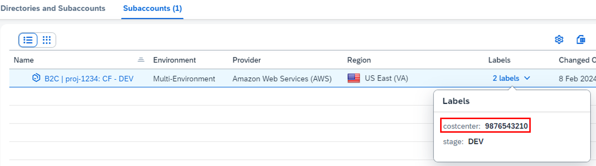
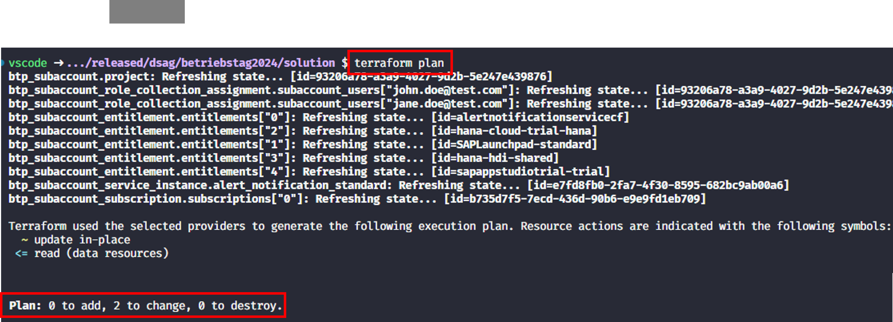
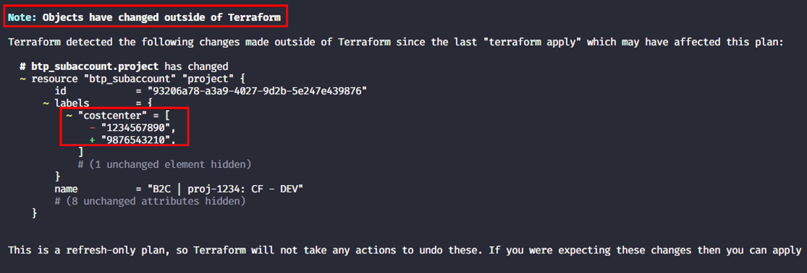
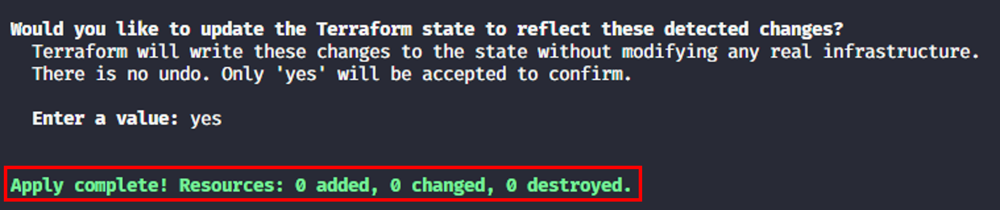
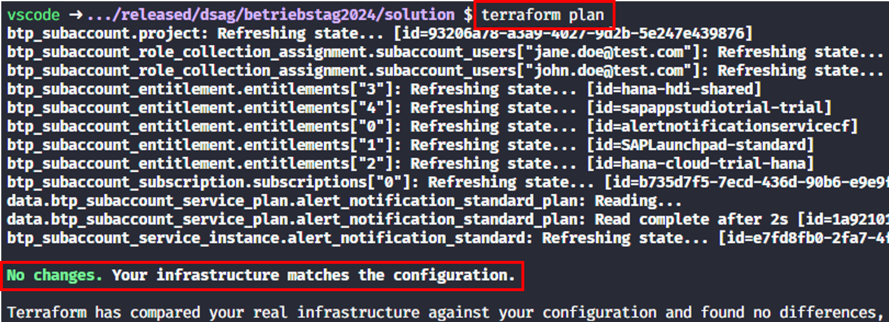
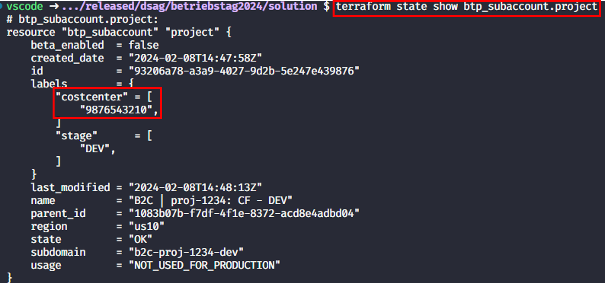

# Exercise 6 - Handle configuration drift

## Goal of this Exercise 🎯

In this exercise, you will learn how to handle configuration drift with Terraform. We will do a manual change in the SAP BTP cockpit and then use Terraform to detect the drift. We will also learn on the options you have to handle this.

## Handle configuration drift

### Step 1: Change label of cost center

We will now introduce a *configuration drift* i.e., we change the label of the cost center in the SAP BTP cockpit. Open the SAP BTP cockpit and navigate to the subaccount. Navigate to the subaccount overview and click on the "..." and then "Edit". Change the label of the cost center to something else and save the change.




Now the Terraform state that you have stored locally will no longer match the actual state of the subaccount in the SAP BTP cockpit. This is called *configuration drift*.

### Step 2: Detect the configuration drift

The easiest way to detect the configuration drift is to run the `terraform plan` command. This will show you the differences between the Terraform state and the actual state in the SAP BTP cockpit.

```bash
terraform plan
```

The command will not do any changes. The output will show you that changes need to be appllied although you have not changed anything in the Terraform configuration:



However, sometimes the output might not perfectly match the drift that you have introduced i.e., some other changes might be shown as well as a consequence of the potential re-creation of the resource. Do not get irritated by the output as the additional changes are in-place changes only where Terraform cannot distinguish if a new attribute value will be applied or not.

### Step 2: Handle configuration drift

A manual change of the configuration could be due to two reasons:

1. Somebody changed the configuration by accident. Consequently, the configuration stored in the Terraform state is the desired one. In this case yo can revert the change in the subaccount by executing a `terraform apply` which will re-apply the configuration stored in the Terraform state.

> [!NOTE]
> You can of course also revert the change in the SAP BTP cockpit (or via the BTP CLI) to match the Terraform state. However this might be a bit cumbersome in a real-world scenario.

2. The manual change was an "emergency" change and is how the configuration should look like. So you need to adjust the state in Terraform to match the actual state in the SAP BTP.

For this hands-on we will focus on the *second case*.

Terraform offers dedicated commands in order to adjust the state We will use the `terraform plan -refresh-only` and `terraform apply -refresh-only` commands to detect the drift and adjust the state in Terraform to match the actual state in the SAP BTP cockpit.

First we check the drift with `terraform plan` and add the `--refresh-only` flag to trigger the planning mode for [state replacement](https://developer.hashicorp.com/terraform/cli/commands/plan#planning-modes):

```bash
terraform plan -refresh-only
```

You can now detect what exactly was changed and how Terraform would change the state to match the actual state in the SAP BTP:



The output shows the update Terraform would apply to the state file to match the actual state in the SAP BTP. Check if the output is what you would expect and then apply the changes:

```bash
terraform apply -refresh-only
```

You should see the following output:



The state should now match the actual state in the SAP BTP.

To be in sync with the new setup we must also override the the default value of the cost center parameter via a new entry in the `terraform.tfvars` file to match the actual state in the SAP BTP. Open the `terraform.tfvars` file and add the following line:

```terraform
costcenter = "<YOUR NEW VALUE>"
```

You can verify this e.g., by executing a `terraform plan` again:



As an alternative you can also use the following command to display the state of the resource:

```bash
terraform state show btp_subaccount.project
```

You should see the following output with the updated value for the cost center label:



The configuration drift is now handled and the Terraform state is in sync with the actual state in the SAP BTP.

> [!WARNING]
> You might also come to the conclusion that the easiest way to deal with such a scenario is to manually change the content of the state file. Manually changing is something you should **never** do in a real world scenario to deal with such scenarios. The state file is a very sensitive file and manual changes can have severe side-effects.

## Additional information

You find more information about managing configuration drift in the Terraform documentation [Manipulating Terraform State](https://developer.hashicorp.com/terraform/cli/state).

## Summary

You've now successfully handled a configuration drift with Terraform.

You have two options now or you can do both:

- If you want to also setup a cloud foundry environment, move on to [Exercise 7 - Setup a Cloud Foundry environment (optional)](../EXERCISE7/README.md).
- If you want to cleanup your environment, move on to [Exercise 8 - Cleanup](../EXERCISE8/README.md).
