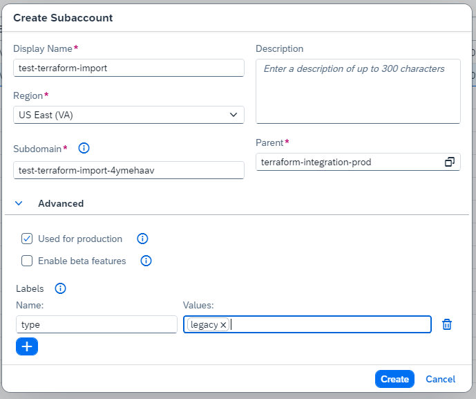

# Import of Terraform resources

## Introduction

In this sample we want to walk you through the *import* of existing resources on SAP BTP into Terraform to be able to manage them via Terraform. We will show the flow via a simple example by importing a subaccount and a service entitlement for this subaccount.

In a nutshell we will:

- Describe how to collect the necessary data for an import.
- Define the matching Terraform configuration for the resources you want to import.
- Define so called import blocks for the resources you want to import to tell Terraform where to find the data for the resources.

We will now walk through this process in detail in the following sections.

## Prerequisites

To have resources that need to be imported we first need to create a subaccount and a service entitlement on SAP BTP using the SAP BTP Cockpit.

We create a subaccount with the following settings:

- Display Name: test-terraform-import
- Region: us10 (depending on the available regions in your account)

In addition, we make the following setting in the section `Advanced`

- We tick the checkbox "Used for production"
- We add a label with the key `type` and the value `legacy`

The configuration result should look like this:



We also assign an entitlement to the subaccount for the service *"Alert Notification"* (technical name `alert-notification`) and the service plan `standard`.

## Data Collection

To configure the resources for the import we must collect the necessary information. For that we must first identify the parameters needed for the resource configuration. We derive the necessary information via the [Terraform provider documentation](https://registry.terraform.io/providers/SAP/btp/latest/docs).

According to the documentation of the [subaccount resource](https://registry.terraform.io/providers/SAP/btp/latest/docs/resources/subaccount) we need the following parameters to match our subaccount setup:

- `name`
- `region`
- `subdomain`
- `usage`
- `labels`

Besides that we must also check the information about the [import of the resource](https://registry.terraform.io/providers/SAP/btp/latest/docs/resources/subaccount#import) to see which keys are needed to import the resource. For the subaccount we need the `subaccount_id` which we anyway know from the SAP BTP Cockpit.

According to the documentation of the [entitlement resource](https://registry.terraform.io/providers/SAP/btp/latest/docs/resources/subaccount_entitlement) we need the following parameters to match our service entitlement setup:

- `plan_name`
- `service_name`
- `subaccount_id`

As for the subaccount we must check the information about the [import of the resource](https://registry.terraform.io/providers/SAP/btp/latest/docs/resources/subaccount_entitlement#import) to see which keys we need for the import. Here we need the `subaccount_id`, the `service_name` and the `plan_name`. We have that information already from resource configuration.

We have different option to retrieve this data. We can:

- determine it via the *SAP BTP Cockpit*.
- use the *BTP CLI* to extract the data. We recommend using the `-format json` option.
- use the Terraform provider namely the *data sources* for the corresponding resources.

Or we can also use a combination of the above.

In this repository we provide a setup via *data sources*. You find the setup in the in the folder `released/import/data-collection`. We leverage the data sources for the subaccount and the service entitlement to collect the necessary information and transfer the data relevant for the import as output variables defined in the `output.tf` file. To execute the data collection for your setup you must create a `terraform.tfvars` file in the `data-collection` folder with the values matching your setup namely:

```terraform
globalaccount     = "<Your global account subdomain>"
subaccount_id     = "<Your subaccount ID>"
service_name      = "alert-notification"
service_plan_name = "standard"
```

The flow to execute the data collection is:

- Navigate to the folder `data-collection`
- Execute `terraform init`
- Execute `terraform apply`

The output the gives you the necessary information for the resource configuration.

> **Note** - The data collection via data sources is a bit overengineered for this simple example. In a real world scenario this can however save you a lot of time compared to navigating through the SAP BTP cockpit.

## Configuring the import

As we have gathered all necessary information we can as a first step define the *configuration of the resources* we want to the import. You find the code in the `released/import/resource-import` folder.

We define the input variables that we later need for the configuration as well as for the import of the resources. The input variables are defined in the file `variables.tf` file as:

```terraform
variable "globalaccount" {
  type        = string
  description = "The globalaccount subdomain."
}

variable "subaccount_name" {
  type        = string
  description = "The subaccount name."
}

variable "subaccount_region" {
  type        = string
  description = "The subaccount region."
}

variable "subaccount_subdomain" {
  type        = string
  description = "The subaccount subdomain."
}

variable "subaccount_usage" {
  type        = string
  description = "The subaccount usage."
}

variable "subaccount_labels" {
  type        = map(set(string))
  description = "The subaccount labels."
}

variable "service_name" {
  type        = string
  description = "The service name."
}

variable "service_plan_name" {
  type        = string
  description = "The service plan name."
}

// Only needed for the import
variable "subaccount_id" {
  type        = string
  description = "The subaccount ID."
}
```

To supply them you must define a `terraform.tfvars` file in the same folder filled with the parameters we collected in the previous step:

```terraform
globalaccount        = "<Your global account subdomain>"
service_name         = "alert-notification"
service_plan_name    = "standard"
subaccount_name      = "<Your Subaccount Name>"
subaccount_region    = "<Your Subaccount region>"
subaccount_subdomain = "<Your Subaccount subdomain>"
subaccount_usage     = "USED_FOR_PRODUCTION"
subaccount_labels    = { "type" = ["legacy"] }
subaccount_id        = "<Your subaccount ID>"
```

We define the configuration for the resources in the `main.tf` file:

```terraform
resource "btp_subaccount" "my_imported_subaccount" {
  name      = var.subaccount_name
  subdomain = var.subaccount_subdomain
  region    = var.subaccount_region
  usage     = var.subaccount_usage
  labels    = var.subaccount_labels
}

resource "btp_subaccount_entitlement" "my_imported_entitlement" {
  subaccount_id = btp_subaccount.my_imported_subaccount.id
  service_name  = var.service_name
  plan_name     = var.service_plan_name
}
```

> **Note** - The configuration should correspond to the configuration you would write when creating the resources from scratch.

The last piece that is missing is the definition of the [import blocks](https://developer.hashicorp.com/terraform/language/import). They provide the connection between the resource configuration and where to find the data for the resource import on the platform. We define them in the `import.tf` file as:

```terraform
import {
  to = btp_subaccount.my_imported_subaccount
  id = var.subaccount_id
}

import {
  to = btp_subaccount_entitlement.my_imported_entitlement
  id = "${var.subaccount_id},${var.service_name},${var.service_plan_name}"
}
```

Be aware of the combined key used for the import of the entitlement resource. The key is a combination of the `subaccount_id`, `service_name` and the `plan_name`.

The setup for an import is now complete. The last step is to execute the import.

## Executing the import

The import is executed via the Terraform CLI in the same flow as the creation of resources. First you must initialize the Terraform configuration:

```bash
terraform init
```

Next we execute a plan to see what Terraform would do:

```bash
terraform plan
```

The result should display that two resources get imported. No additions, changes or deletions should be planned. The output should look like this:

```bash	
btp_subaccount.my_imported_subaccount: Preparing import... [id=XYZ]
btp_subaccount.my_imported_subaccount: Refreshing state... [id=XYZ]
btp_subaccount_entitlement.my_imported_entitlement: Preparing import... [id=XYZ,alert-notification,standard]
btp_subaccount_entitlement.my_imported_entitlement: Refreshing state...

Terraform will perform the following actions:

  # btp_subaccount.my_imported_subaccount will be imported
    resource "btp_subaccount" "my_imported_subaccount" {
        beta_enabled  = false
        created_by    = "christian.lechner@sap.com"
        created_date  = "2024-04-10T12:43:08Z"
        id            = "XYZ"
        labels        = {
            "type" = [
                "legacy",
            ]
        }
        last_modified = "2024-04-10T12:43:29Z"
        name          = "test-terraform-import"
        parent_id     = "ZYX"
        region        = "us10"
        state         = "OK"
        subdomain     = "test-terraform-import-abc1234"
        usage         = "USED_FOR_PRODUCTION"
    }

  # btp_subaccount_entitlement.my_imported_entitlement will be imported
    resource "btp_subaccount_entitlement" "my_imported_entitlement" {
        amount        = 2
        category      = "ELASTIC_SERVICE"
        created_date  = "2024-04-10T13:37:44Z"
        id            = "alertnotificationservicecf"
        last_modified = "2024-04-10T13:37:53Z"
        plan_id       = "alertnotificationservicecf"
        plan_name     = "standard"
        service_name  = "alert-notification"
        state         = "OK"
        subaccount_id = "XYZ"
    }

Plan: 2 to import, 0 to add, 0 to change, 0 to destroy.
```

> **Note** In case that Terraform plans to apply unexpected changes or even additions or deletions of resources, you should revisit our configuration in the `main.tf` file and make adjustments, until the `terraform plan` output shows only planned imports.

To execute the import, we run:

```bash
terraform apply
```

As a result we see a `terraform.tfstate` file in our filesystem. 

To validate that we have brought the manually created resources under the control of Terraform we execute a `terraform plan` which should state that:

```bash
No changes. Your infrastructure matches the configuration.

Terraform has compared your real infrastructure against your configuration and found no differences, so no changes are needed.
```

The import was successful, and you can manage the imported resources via Terraform.

## Additional Information

You find more information about the Teraform import functionality in the [Terraform documentation](https://www.terraform.io/docs/cli/import/index.html).
